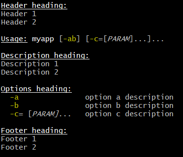

//////////////////////////////////////////

  Licensed to the Apache Software Foundation (ASF) under one
  or more contributor license agreements.  See the NOTICE file
  distributed with this work for additional information
  regarding copyright ownership.  The ASF licenses this file
  to you under the Apache License, Version 2.0 (the
  "License"); you may not use this file except in compliance
  with the License.  You may obtain a copy of the License at

    http://www.apache.org/licenses/LICENSE-2.0

  Unless required by applicable law or agreed to in writing,
  software distributed under the License is distributed on an
  "AS IS" BASIS, WITHOUT WARRANTIES OR CONDITIONS OF ANY
  KIND, either express or implied.  See the License for the
  specific language governing permissions and limitations
  under the License.

//////////////////////////////////////////

= Domain-Specific Languages

== Command chains

Groovy lets you omit parentheses around the arguments of a
method call for top-level statements. "command chain" feature extends this by allowing us to chain such
parentheses-free method calls, requiring neither parentheses around arguments, nor dots between the chained calls.
The general idea is that a call like `a b c d` will actually be equivalent to `a(b).c(d)`. This
also works with multiple arguments, closure arguments, and even named arguments. Furthermore, such command chains can
also appear on the right-hand side of assignments. Let’s have a look at some examples
supported by this new syntax:

[source,groovy]
---------------------------------------------------------------------------------------------------------------
include::{projectdir}/src/spec/test/CommandChainsTest.groovy[tags=commandchain_1,indent=0]

include::{projectdir}/src/spec/test/CommandChainsTest.groovy[tags=commandchain_2,indent=0]

include::{projectdir}/src/spec/test/CommandChainsTest.groovy[tags=commandchain_3,indent=0]

include::{projectdir}/src/spec/test/CommandChainsTest.groovy[tags=commandchain_4,indent=0]

include::{projectdir}/src/spec/test/CommandChainsTest.groovy[tags=commandchain_5,indent=0]
---------------------------------------------------------------------------------------------------------------

It is also possible to use methods in the chain which take no arguments,
but in that case, the parentheses are needed:

[source,groovy]
-------------------------------------------------------------------------------------------------
include::{projectdir}/src/spec/test/CommandChainsTest.groovy[tags=commandchain_6,indent=0]
-------------------------------------------------------------------------------------------------

If your command chain contains an odd number of elements, the chain will
be composed of method / arguments, and will finish by a final property
access:

[source,groovy]
-------------------------------------------------------------------------------------
include::{projectdir}/src/spec/test/CommandChainsTest.groovy[tags=commandchain_7,indent=0]
-------------------------------------------------------------------------------------

This command chain approach opens up interesting possibilities in terms of the much wider range of DSLs which
can now be written in Groovy.

The above examples illustrate using a command chain based DSL but not how to create one. There are various strategies
that you can use, but to illustrate creating such a DSL, we will show a couple of examples - first using maps and Closures:

[source,groovy]
------------------------------------------------------------------------------------------------------
include::{projectdir}/src/spec/test/CommandChainsTest.groovy[tags=commandchain_impl1,indent=0]
------------------------------------------------------------------------------------------------------

As a second example, consider how you might write a DSL for simplifying
one of your existing APIs. Maybe you need to put this code in front of
customers, business analysts or testers who might be not hard-core Java
developers. We’ll use the `Splitter` from the Google
https://github.com/google/guava[Guava libraries] project as it
already has a nice Fluent API. Here is how we might use it out of the
box:

[source,groovy]
----------------------------------------------------------------------------------------------------------------
include::{projectdir}/src/spec/test/CommandChainsTest.groovy[tags=commandchain_impl2,indent=0]
include::{projectdir}/src/spec/test/CommandChainsTest.groovy[tags=commandchain_impl2_assert,indent=0]
----------------------------------------------------------------------------------------------------------------

It reads fairly well for a Java developer but if that is not your target
audience or you have many such statements to write, it could be
considered a little verbose. Again, there are many options for writing a
DSL. We’ll keep it simple with Maps and Closures. We’ll first write a
helper method:

[source,groovy]
------------------------------------------------------------------------------------------------------
include::{projectdir}/src/spec/test/CommandChainsTest.groovy[tags=commandchain_impl3,indent=0]
------------------------------------------------------------------------------------------------------

now instead of this line from our original example:

[source,groovy]
----------------------------------------------------------------------------------------------------------------
include::{projectdir}/src/spec/test/CommandChainsTest.groovy[tags=commandchain_impl2_assert,indent=0]
----------------------------------------------------------------------------------------------------------------

we can write this:

[source,groovy]
-----------------------------------------------------
include::{projectdir}/src/spec/test/CommandChainsTest.groovy[tags=commandchain_impl3_assert,indent=0]
-----------------------------------------------------

== Operator overloading

Various operators in Groovy are mapped onto regular method calls on objects.

This allows you to provide your own Java or Groovy objects which can take advantage of operator overloading. The following table describes the operators supported in Groovy and the methods they map to.

[options="header"]
|======================
|Operator | Method 
| `a + b` | a.plus(b)
| `a - b` | a.minus(b)
| `a * b` | a.multiply(b)
| `a ** b` | a.power(b)
| `a / b` | a.div(b)
| `a % b` | a.mod(b)
| `a \| b` | a.or(b)
| `a & b` | a.and(b)
| `a ^ b` | a.xor(b)
| `pass:[a++]` or `pass:[++a]` | a.next()
| `a--` or `--a` | a.previous()
| `a[b]` | a.getAt(b)
| `a[b] = c` | a.putAt(b, c)
| `a << b` | a.leftShift(b)
| `a >> b` | a.rightShift(b)
| `a >>> b` | a.rightShiftUnsigned(b)
| `switch(a) { case(b) : }` | b.isCase(a)
| `if(a)` | a.asBoolean()
| `~a` | a.bitwiseNegate()
| `-a` | a.negative()
| `+a` | a.positive()
| `a as b` | a.asType(b)
| `a == b` | a.equals(b)
| `a != b` | ! a.equals(b)
| `a pass:[<=>] b` | a.compareTo(b)
| `a > b` | a.compareTo(b) > 0
| `a >= b` | a.compareTo(b) >= 0
| `a < b` | a.compareTo(b) < 0
| `a \<= b` | a.compareTo(b) \<= 0
|======================

== Script base classes
=== The Script class
Groovy scripts are always compiled to classes. For example, a script as simple as:

[source,groovy]
----
include::{projectdir}/src/spec/test/BaseScriptSpecTest.groovy[tags=simple_script,indent=0]
----

is compiled to a class extending the abstract gapi:groovy.lang.Script[] class. This class contains a single abstract
method called _run_. When a script is compiled, then its body will become the _run_ method, while the other methods
found in the script are found in the implementing class. The `Script` class provides base support for integration
with your application through the `Binding` object, as illustrated in this example:

[source,groovy]
----
include::{projectdir}/src/spec/test/BaseScriptSpecTest.groovy[tags=integ_binding,indent=0]
----
<1> a binding is used to share data between the script and the calling class
<2> a `GroovyShell` can be used with this binding
<3> input variables are set from the calling class inside the binding
<4> then the script is evaluated
<5> and the `z` variable has been "exported" into the binding

This is a very practical way to share data between the caller and the script, however it may be insufficient or not
practical in some cases. For that purpose, Groovy allows you to set your own base script class. A base script class
has to extend gapi:groovy.lang.Script[] and be a single abstract method type:

[source,groovy]
----
include::{projectdir}/src/spec/test/BaseScriptSpecTest.groovy[tags=baseclass_def,indent=0]
----

Then the custom script base class can be declared in the compiler configuration, for example:

[source,groovy]
----
include::{projectdir}/src/spec/test/BaseScriptSpecTest.groovy[tags=use_custom_conf,indent=0]
----
<1> create a custom compiler configuration
<2> set the base script class to our custom base script class
<3> then create a `GroovyShell` using that configuration
<4> the script will then extend the base script class, giving direct access to the `name` property and `greet` method

[[dsl-basescript]]
=== The @BaseScript annotation

As an alternative, it is also possible to use the `@BaseScript` annotation directly into a script:

[source,groovy]
----
include::{projectdir}/src/spec/test/BaseScriptSpecTest.groovy[tags=use_basescript,indent=0]
----

where `@BaseScript` should annotate a variable which type is the class of the base script. Alternatively, you can set
the base script class as a member of the `@BaseScript` annotation itself:

[source,groovy]
----
include::{projectdir}/src/spec/test/BaseScriptSpecTest.groovy[tags=use_basescript_alt,indent=0]
----

=== Alternate abstract method

We have seen that the base script class is a single abstract method type that needs to implement the `run` method. The
`run` method is executed by the script engine automatically. In some circumstances it may be interesting to have a base
class which implements the `run` method, but provides an alternative abstract method to be used for the script body.
For example, the base script `run` method might perform some initialization before the `run` method is executed. This
is possible by doing this:

[source,groovy]
----
include::{projectdir}/src/spec/test/BaseScriptSpecTest.groovy[tags=custom_run_method,indent=0]
----
<1> the base script class should define one (and only one) abstract method
<2> the `run` method can be overridden and perform a task before executing the script body
<3> `run` calls the abstract `scriptBody` method which will delegate to the user script
<4> then it can return something else than the value from the script

If you execute this code:

[source,groovy]
----
include::{projectdir}/src/spec/test/BaseScriptSpecTest.groovy[tags=custom_run_eval,indent=0]
----

Then you will see that the script is executed, but the result of the evaluation is `1` as returned by the `run`
method of the base class. It is even clearer if you use `parse` instead of `evaluate`, because it would allow you to
execute the `run` method several times on the same script instance:

[source,groovy]
----
include::{projectdir}/src/spec/test/BaseScriptSpecTest.groovy[tags=custom_run_parse,indent=0]
----

== Adding properties to numbers

In Groovy number types are considered equal to any other types. As such, it is possible to enhance numbers by adding
properties or methods to them. This can be very handy when dealing with measurable quantities for example. Details about
how existing classes can be enhanced in Groovy are found in the link:core-metaprogramming.html#_extension_modules[extension
modules] section or the link:core-metaprogramming.html#categories[categories] section.

An illustration of this can be found in Groovy using the `TimeCategory`:

[source,groovy]
----
include::{projectdir}/src/spec/test/metaprogramming/CategoryTest.groovy[tags=time_category,indent=0]
----
<1> using the `TimeCategory`, a property `minute` is added to the `Integer` class
<2> similarily, the `months` method returns a `groovy.time.DatumDependentDuration` which can be used in calculus

Categories are lexically bound, making them a great fit for internal DSLs.

[[section-delegatesto]]
== @DelegatesTo

[[TheDelegatesToannotation-DSLsmadeeasy]]
=== Explaining delegation strategy at compile time

`@groovy.lang.DelegatesTo` is a documentation and compile-time annotation aimed at:

 * documenting APIs that use closures as arguments
 * providing type information for the static type checker and compiler

The Groovy language is a platform of choice for building DSLs. Using
closures, it’s quite easy to create custom control structures, as well
as it is simple to create builders. Imagine that you have the following
code:

[source,groovy]
---------------------------------------
include::{projectdir}/src/spec/test/DelegatesToSpecTest.groovy[tags=email_builder_usage,indent=0]
---------------------------------------

One way of implementing this is using the builder strategy, which
implies a method, named `email` which accepts a closure as an argument.
The method may delegate subsequent calls to an object that implements
the `from`, `to`, `subject` and `body` methods. Again, `body` is a
method which accepts a closure as an argument and that uses the builder
strategy.

Implementing such a builder is usually done the following way:

[source,groovy]
----------------------------------------------
include::{projectdir}/src/spec/test/DelegatesToSpecTest.groovy[tags=email_method_no_delegatesto,indent=0]
----------------------------------------------

the `EmailSpec` class implements the `from`, `to`, … methods. By
calling `rehydrate`, we’re creating a copy of the closure for which we
set the `delegate`, `owner` and `thisObject` values. Setting the owner
and the `this` object is not very important here since we will use the
`DELEGATE_ONLY` strategy which says that the method calls will be
resolved only against the delegate of the closure.

[source,groovy]
----------------------------------------------
include::{projectdir}/src/spec/test/DelegatesToSpecTest.groovy[tags=emailspec_no_delegatesto,indent=0]
----------------------------------------------

The `EmailSpec` class has itself a `body` method accepting a closure that is cloned and executed. This is what
we call the builder pattern in Groovy.

One of the problems with the code that we’ve shown is that the user of
the `email` method doesn’t have any information about the methods that
he’s allowed to call inside the closure. The only possible information
is from the method documentation. There are two issues with this: first
of all, documentation is not always written, and if it is, it’s not
always available (javadoc not downloaded, for example). Second, it
doesn’t help IDEs. What would be really interesting, here, is for IDEs
to help the developer by suggesting, once they are in the closure body,
methods that exist on the `email` class.

Moreover, if the user calls a method in the closure which is not defined
by the `EmailSpec` class, the IDE should at least issue a warning (because
it’s very likely that it will break at runtime).

One more problem with the code above is that it is not compatible with static type checking. Type checking would let
the user know if a method call is authorized at compile time instead of runtime, but if you try to perform type
checking on this code:

[source,groovy]
---------------------------------------
include::{projectdir}/src/spec/test/DelegatesToSpecTest.groovy[tags=email_builder_usage,indent=0]
---------------------------------------

Then the type checker will know that there’s an `email` method accepting
a `Closure`, but it will complain for every method call *inside* the
closure, because `from`, for example, is not a method which is defined
in the class. Indeed, it’s defined in the `EmailSpec` class and it has
absolutely no hint to help it knowing that the closure delegate will, at
runtime, be of type `EmailSpec`:

[source,groovy]
---------------------------------------
include::{projectdir}/src/spec/test/DelegatesToSpecTest.groovy[tags=sendmail_typechecked_nodelegatesto,indent=0]
---------------------------------------

will fail compilation with errors like this one:

----
[Static type checking] - Cannot find matching method MyScript#from(java.lang.String). Please check if the declared type is correct and if the method exists.
 @ line 31, column 21.
                       from 'dsl-guru@mycompany.com'
----

[[TheDelegatesToannotation-DelegatesTo]]
=== @DelegatesTo

For those reasons, Groovy 2.1 introduced a new annotation
named `@DelegatesTo`. The goal of this annotation is to solve both the
documentation issue, that will let your IDE know about the expected
methods in the closure body, and it will also solve the type checking
issue, by giving hints to the compiler about what are the potential
receivers of method calls in the closure body.

The idea is to annotate the `Closure` parameter of the `email` method:

[source,groovy]
---------------------------------------
include::{projectdir}/src/spec/test/DelegatesToSpecTest.groovy[tags=email_method_delegatesto,indent=0]
---------------------------------------

What we’ve done here is telling the compiler (or the IDE) that when the
method will be called with a closure, the delegate of this closure will
be set to an object of type `email`. But there is still a problem: the
default delegation strategy is not the one which is used in our method.
So we will give more information and tell the compiler (or the IDE) that
the delegation strategy is also changed:

[source,groovy]
---------------------------------------
include::{projectdir}/src/spec/test/DelegatesToSpecTest.groovy[tags=email_method_delegatesto_strategy,indent=0]
---------------------------------------

Now, both the IDE and the type checker (if you are using `@TypeChecked`)
will be aware of the delegate and the delegation strategy. This is very
nice because it will both allow the IDE to provide smart completion, but
it will also remove errors at compile time that exist only because the
behaviour of the program is normally only known at runtime!

The following code will now pass compilation:

[source,groovy]
---------------------------------------
include::{projectdir}/src/spec/test/DelegatesToSpecTest.groovy[tags=sendmail_typechecked_pass,indent=0]
---------------------------------------

[[TheDelegatesToannotation-DelegatesTomodes]]
=== DelegatesTo modes

`@DelegatesTo` supports multiple modes that we will describe with examples
in this section.

[[TheDelegatesToannotation-Simpledelegation]]
==== Simple delegation

In this mode, the only mandatory parameter is the _value_ which says to
which class we delegate calls. Nothing more. We’re telling the compiler
that the type of the delegate will *always* be of the type documented
by `@DelegatesTo` (note that it can be a subclass, but if it is, the
methods defined by the subclass will not be visible to the type
checker).

[source,groovy]
-----------------------------------------------
include::{projectdir}/src/spec/test/DelegatesToSpecTest.groovy[tags=simple_delegation,indent=0]
-----------------------------------------------

[[TheDelegatesToannotation-Delegationstrategy]]
==== Delegation strategy

In this mode, you must specify both the delegate class *and* a
delegation strategy. This must be used if the closure will not be called
with the default delegation strategy, which is `Closure.OWNER_FIRST`.

[source,groovy]
----------------------------------------------------------------------------------
include::{projectdir}/src/spec/test/DelegatesToSpecTest.groovy[tags=delegation_with_strategy,indent=0]
----------------------------------------------------------------------------------

[[TheDelegatesToannotation-Delegatetoparameter]]
==== Delegate to parameter

In this variant, we will tell the compiler that we are delegating to
another parameter of the method. Take the following code:

[source,groovy]
-------------------------------------------------
include::{projectdir}/src/spec/test/DelegatesToSpecTest.groovy[tags=exec_method_no_delegatesto,indent=0]
-------------------------------------------------

Here, the delegate which will be used is *not* created inside the `exec`
method. In fact, we take an argument of the method and delegate to it.
Usage may look like this:

[source,groovy]
-----------------------
include::{projectdir}/src/spec/test/DelegatesToSpecTest.groovy[tags=exec_usage,indent=0]
-----------------------

Each of the method calls are delegated to the `email` parameter. This is
a widely used pattern which is also supported by `@DelegatesTo` using a
companion annotation:

[source,groovy]
---------------------------------------------------------------
include::{projectdir}/src/spec/test/DelegatesToSpecTest.groovy[tags=exec_method_with_delegatesto,indent=0]
---------------------------------------------------------------

A closure is annotated with `@DelegatesTo`, but this time, without
specifying any class. Instead, we’re annotating another parameter
with `@DelegatesTo.Target`. The type of the delegate is then determined
at compile time. One could think that we are using the parameter type,
which in this case is `Object` but this is not true. Take this code:

[source,groovy]
--------------------------------------
include::{projectdir}/src/spec/test/DelegatesToSpecTest.groovy[tags=delegatesto_flow_typing_header,indent=0]
include::{projectdir}/src/spec/test/DelegatesToSpecTest.groovy[tags=delegatesto_flow_typing_footer,indent=0]
--------------------------------------

Remember that this works out of the box *without* having to annotate
with `@DelegatesTo`. However, to make the IDE aware of the delegate
type, or the *type checker* aware of it, we need to add `@DelegatesTo`.
And in this case, it will know that the `Greeter` variable is of
type `Greeter`, so it will not report errors on the _sayHello_
method *even if the exec method doesn’t explicitly define the target as
of type Greeter*. This is a very powerful feature, because it prevents
you from writing multiple versions of the same `exec` method for
different receiver types!

In this mode, the `@DelegatesTo` annotation also supports the `strategy`
parameter that we’ve described upper.

[[TheDelegatesToannotation-Multipleclosures]]
==== Multiple closures

In the previous example, the `exec` method accepted only one closure,
but you may have methods that take multiple closures:

[source,groovy]
--------------------------------------------------------------------
include::{projectdir}/src/spec/test/DelegatesToSpecTest.groovy[tags=foobarbaz_method_no_delegatesto,indent=0]
--------------------------------------------------------------------

Then nothing prevents you from annotating each closure
with `@DelegatesTo`:

[source,groovy]
--------------------------------------------------------------------
include::{projectdir}/src/spec/test/DelegatesToSpecTest.groovy[tags=foobarbaz_classes,indent=0]

include::{projectdir}/src/spec/test/DelegatesToSpecTest.groovy[tags=foobarbaz_method_header,indent=0]
   ...
include::{projectdir}/src/spec/test/DelegatesToSpecTest.groovy[tags=foobarbaz_method_footer,indent=0]
--------------------------------------------------------------------

But more importantly, if you have multiple closures *and* multiple
arguments, you can use several targets:

[source,groovy]
-----------------------------------------------------------------------------
include::{projectdir}/src/spec/test/DelegatesToSpecTest.groovy[tags=foobarbaz_multitarget,indent=0]

include::{projectdir}/src/spec/test/DelegatesToSpecTest.groovy[tags=multitarget_test,indent=0]
-----------------------------------------------------------------------------

NOTE: At this point, you may wonder why we don’t use the parameter names as
references. The reason is that the information (the parameter name) is
not always available (it’s a debug-only information), so it’s a
limitation of the JVM.

==== Delegating to a generic type

In some situations, it is interesting to instruct the IDE or the compiler that the delegate type will not be a parameter
but a generic type. Imagine a configurator that runs on a list of elements:

[source,groovy]
----
include::{projectdir}/src/spec/test/DelegatesToSpecTest.groovy[tags=configure_list_method,indent=0]
----

Then this method can be called with any list like this:

[source,groovy]
----
include::{projectdir}/src/spec/test/DelegatesToSpecTest.groovy[tags=configure_list_usage,indent=0]
----

To let the type checker and the IDE know that the `configure` method calls the closure on each element of the list, you
 need to use `@DelegatesTo` differently:

[source,groovy]
----
include::{projectdir}/src/spec/test/DelegatesToSpecTest.groovy[tags=configure_list_with_delegatesto,indent=0]
----

`@DelegatesTo` takes an optional `genericTypeIndex` argument that tells what is the index of the generic type that will
be used as the delegate type. This *must* be used in conjunction with `@DelegatesTo.Target` and the index starts at 0. In
the example above, that means that the delegate type is resolved against `List<T>`, and since the generic type at index
0 is `T` and inferred as a `Realm`, the type checker infers that the delegate type will be of type `Realm`.

NOTE: We're using a `genericTypeIndex` instead of a placeholder (`T`) because of JVM limitations.

==== Delegating to an arbitrary type

It is possible that none of the options above can represent the type you want to delegate to. For example, let's define
a mapper class which is parametrized with an object and defines a map method which returns an object of another type:

[source,groovy]
----
include::{projectdir}/src/spec/test/DelegatesToSpecTest.groovy[tags=delegatestotype_mapper,indent=0]
----
<1> The mapper class takes two generic type arguments: the source type and the target type
<2> The source object is stored in a final field
<3> The `map` method asks to convert the source object to a target object

As you can see, the method signature from `map` does not give any information about what object will
be manipulated by the closure. Reading the method body, we know that it will be the `value` which is
of type `T`, but `T` is not found in the method signature, so we are facing a case where none of the
available options for `@DelegatesTo` is suitable. For example, if we try to statically compile this code:

[source,groovy]
----
include::{projectdir}/src/spec/test/DelegatesToSpecTest.groovy[tags=delegatestotype_mapper_test,indent=0]
----

Then the compiler will fail with:

----
Static type checking] - Cannot find matching method TestScript0#length()
----

In that case, you can use the `type` member of the `@DelegatesTo` annotation to reference `T` as a type token:

[source,groovy]
----
include::{projectdir}/src/spec/test/DelegatesToSpecTest.groovy[tags=delegatestotype_mapper_fixed,indent=0]
----
<1> The `@DelegatesTo` annotation references a generic type which is not found in the method signature

Note that you are not limited to generic type tokens. The `type` member can be used to represent complex types, such
as `List<T>` or `Map<T,List<U>>`. The reason why you should use that in last resort is that the type is only checked
when the type checker finds usage of `@DelegatesTo`, not when the annotated method itself is compiled. This means that
type safety is only ensured at the call site. Additionally, compilation will be slower (though probably unnoticeable for
most cases).

[[compilation-customizers]]
== Compilation customizers
=== Introduction

Whether you are using `groovyc` to compile classes or a `GroovyShell`,
for example, to execute scripts, under the hood, a _compiler configuration_ is used. This configuration holds information
like the source encoding or the classpath but it can also be used to perform more operations like adding imports by
default, applying AST transformations transparently or disabling global AST transformations.

The goal of compilation customizers is to make those common tasks easy to implement. For that, the `CompilerConfiguration`
class is the entry point. The general schema will always be based on the following code:

[source,groovy]
--------------------------------------------------------
import org.codehaus.groovy.control.CompilerConfiguration
// create a configuration
def config = new CompilerConfiguration()
// tweak the configuration
config.addCompilationCustomizers(...)
// run your script
def shell = new GroovyShell(config)
shell.evaluate(script)
--------------------------------------------------------

Compilation customizers must extend the _org.codehaus.groovy.control.customizers.CompilationCustomizer_ class. A customizer works:

* on a specific compilation phase
* on _every_ class node being compiled

You can implement your own compilation customizer but Groovy includes some of the most common operations.

=== Import customizer

Using this compilation customizer, your code will have imports added
transparently. This is in particular useful for scripts implementing a
DSL where you want to avoid users from having to write imports. The
import customizer will let you add all the variants of imports the
Groovy language allows, that is:

* class imports, optionally aliased
* star imports
* static imports, optionally aliased
* static star imports

[source,groovy]
-----------------------------------------------------------------------------------------------------
import org.codehaus.groovy.control.customizers.ImportCustomizer

include::{projectdir}/src/spec/test/CustomizersTest.groovy[tags=import_cz,indent=0]
-----------------------------------------------------------------------------------------------------

A detailed description of all shortcuts can be found in gapi:org.codehaus.groovy.control.customizers.ImportCustomizer[]

=== AST transformation customizer

The AST transformation customizer is meant to apply AST transformations
transparently. Unlike global AST transformations that apply on every
class being compiled as long as the transform is found on classpath
(which has drawbacks like increasing the compilation time or side
effects due to transformations applied where they should not), the
customizer will allow you to selectively apply a transform only for
specific scripts or classes.

As an example, let’s say you want to be able to use `@Log` in a script.
The problem is that `@Log` is normally applied on a class node and a
script, by definition, doesn’t require one. But implementation wise,
scripts are classes, it’s just that you cannot annotate this implicit
class node with `@Log`. Using the AST customizer, you have a workaround
to do it:

[source,groovy]
--------------------------------------------------------------------------
import org.codehaus.groovy.control.customizers.ASTTransformationCustomizer
import groovy.util.logging.Log

include::{projectdir}/src/spec/test/CustomizersTest.groovy[tags=ast_cz_simple,indent=0]
--------------------------------------------------------------------------

That’s all! Internally, the `@Log` AST transformation is applied to
every class node in the compilation unit. This means that it will be
applied to the script, but also to classes defined within the script.

If the AST transformation that you are using accepts parameters, you can
use parameters in the constructor too:

[source,groovy]
-----------------------------------------------------------------------------------------------------------------
include::{projectdir}/src/spec/test/CustomizersTest.groovy[tags=ast_cz_customname,indent=0]
-----------------------------------------------------------------------------------------------------------------

As the AST transformation customizers works with objects instead of AST
nodes, not all values can be converted to AST transformation parameters.
For example, primitive types are converted to `ConstantExpression` (that
is `LOGGER` is converted to `new ConstantExpression('LOGGER')`, but if
your AST transformation takes a closure as an argument, then you have to
give it a `ClosureExpression`, like in the following example:

[source,groovy]
--------------------------------------------------------------------------------------------------------------
include::{projectdir}/src/spec/test/CustomizersTest.groovy[tags=ast_cz_closure,indent=0]
--------------------------------------------------------------------------------------------------------------

For a complete list of options, please refer to gapi:org.codehaus.groovy.control.customizers.ASTTransformationCustomizer[]

=== Secure AST customizer

This customizer will allow the developer of a DSL to restrict the
*grammar* of the language, to prevent users from using some constructs,
for example. It is only ``secure'' in that sense only and it is very
important to understand that it does *not* replace a security manager.
The only reason for it to exist is to limit the expressiveness of the
language. This customizer only works at the AST (abstract syntax tree)
level, not at runtime! It can be strange at first glance, but it makes
much more sense if you think of Groovy as a platform to build DSLs. You
may not want a user to have a complete language at hand. In the example
below, we will demonstrate it using an example of language that only
allows arithmetic operations, but this customizer allows you to:

* allow/disallow creation of closures
* allow/disallow imports
* allow/disallow package definition
* allow/disallow definition of methods
* restrict the receivers of method calls
* restrict the kind of AST expressions a user can use
* restrict the tokens (grammar-wise) a user can use
* restrict the types of the constants that can be used in code

For all those features, the secure AST customizer works using either a
whitelist (list of elements that are allowed) *or* a blacklist (list of
elements that are disallowed). For each type of feature (imports,
tokens, …) you have the choice to use either a whitelist or a blacklist,
but you can mix whitelists and blacklists for distinct features. In
general, you will choose whitelists (disallow all, allow selected).

[source,groovy]
-------------------------------------------------------------------------------------
import org.codehaus.groovy.control.customizers.SecureASTCustomizer
import static org.codehaus.groovy.syntax.Types.* <1>

include::{projectdir}/src/spec/test/CustomizersTest.groovy[tags=secure_cz,indent=0]
-------------------------------------------------------------------------------------
<1> use for token types from gapi:org.codehaus.groovy.syntax.Types[]
<2> you can use class literals here

If what the secure AST customizer provides out of the box isn’t enough
for your needs, before creating your own compilation customizer, you
might be interested in the expression and statement checkers that the
AST customizer supports. Basically, it allows you to add custom checks
on the AST tree, on expressions (expression checkers) or statements
(statement checkers). For this, you must
implement `org.codehaus.groovy.control.customizers.SecureASTCustomizer.StatementChecker`
or `org.codehaus.groovy.control.customizers.SecureASTCustomizer.ExpressionChecker`.

Those interfaces define a single method called `isAuthorized`, returning
a boolean, and taking a `Statement` (or `Expression`) as a parameter. It
allows you to perform complex logic over expressions or statements to
tell if a user is allowed to do it or not.

For example, there's no predefined configuration flag in the customizer which
will let you prevent people from using an attribute expression. Using a custom
checker, it is trivial:

[source,groovy]
----------------------------------------------------------------------
include::{projectdir}/src/spec/test/CustomizersTest.groovy[tags=secure_cz_custom,indent=0]
----------------------------------------------------------------------

Then we can make sure that this works by evaluating a simple script:

[source,groovy]
----
new GroovyShell(config).evaluate '''
include::{projectdir}/src/spec/test/CustomizersTest.groovy[tags=secure_cz_custom_assert,indent=4]
'''
----
<1> will fail compilation

Statements can be checked using gapi:org.codehaus.groovy.control.customizers.SecureASTCustomizer.StatementChecker[]
Expressions can be checked using gapi:org.codehaus.groovy.control.customizers.SecureASTCustomizer.ExpressionChecker[]

=== Source aware customizer

This customizer may be used as a filter on other customizers. The
filter, in that case, is the `org.codehaus.groovy.control.SourceUnit`.
For this, the source aware customizer takes another customizer as a
delegate, and it will apply customization of that delegate only and only
if predicates on the source unit match.

`SourceUnit` gives you access to multiple things but in particular the
file being compiled (if compiling from a file, of course). It gives
you the potential to perform operation based on the file name, for
example. Here is how you would create a source aware customizer:

[source,groovy]
--------------------------------------------------------------------
import org.codehaus.groovy.control.customizers.SourceAwareCustomizer
import org.codehaus.groovy.control.customizers.ImportCustomizer

include::{projectdir}/src/spec/test/CustomizersTest.groovy[tags=source_cz,indent=0]
--------------------------------------------------------------------

Then you can use predicates on the source aware customizer:

[source,groovy]
--------------------------------------------------------------------------
include::{projectdir}/src/spec/test/CustomizersTest.groovy[tags=source_cz_predicates,indent=0]
--------------------------------------------------------------------------

=== Customizer builder

If you are using compilation customizers in Groovy code (like the
examples above) then you can use an alternative syntax to customize compilation.
A builder (`org.codehaus.groovy.control.customizers.builder.CompilerCustomizationBuilder`)
simplifies the creation of customizers using a hierarchical DSL.

[source,groovy]
-----------------------------------------------------------------------------------------------------
import org.codehaus.groovy.control.CompilerConfiguration
import static org.codehaus.groovy.control.customizers.builder.CompilerCustomizationBuilder.withConfig <1>

include::{projectdir}/src/spec/test/CustomizersTest.groovy[tags=customizer_withconfig,indent=0]
-----------------------------------------------------------------------------------------------------
<1> static import of the builder method
<2> configuration goes here

The code sample above shows how to use the builder. A static
method, _withConfig_, takes a closure corresponding to the builder code,
and automatically registers compilation customizers to the
configuration. Every compilation customizer available in the distribution
can be configured this way:

==== Import customizer

[source,groovy]
----------------------------------------------------------------------------------
withConfig(configuration) {
   imports { // imports customizer
      normal 'my.package.MyClass' // a normal import
      alias 'AI', 'java.util.concurrent.atomic.AtomicInteger' // an aliased import
      star 'java.util.concurrent' // star imports
      staticMember 'java.lang.Math', 'PI' // static import
      staticMember 'pi', 'java.lang.Math', 'PI' // aliased static import
   }
}
----------------------------------------------------------------------------------

==== AST transformation customizer

[source,groovy]
-------------------------------------------
withConfig(conf) {
   ast(Log) <1>
}

withConfig(conf) {
   ast(Log, value: 'LOGGER') <2>
}
-------------------------------------------
<1> apply @Log transparently
<2> apply @Log with a different name for the logger

==== Secure AST customizer

[source,groovy]
--------------------------------------
withConfig(conf) {
   secureAst {
       closuresAllowed = false
       methodDefinitionAllowed = false
   }
}
--------------------------------------

==== Source aware customizer

[source,groovy]
--------------------------------------------------------------------------------------
withConfig(configuration){
    source(extension: 'sgroovy') {
        ast(CompileStatic) <1>
    }
}

withConfig(configuration){
    source(extensions: ['sgroovy','sg']) {
        ast(CompileStatic) <2>
    }
}

withConfig(configuration) {
    source(extensionValidator: { it.name in ['sgroovy','sg']}) {
        ast(CompileStatic) <2>
    }
}

withConfig(configuration) {
    source(basename: 'foo') {
        ast(CompileStatic) <3>
    }
}

withConfig(configuration) {
    source(basenames: ['foo', 'bar']) {
        ast(CompileStatic) <4>
    }
}

withConfig(configuration) {
    source(basenameValidator: { it in ['foo', 'bar'] }) {
        ast(CompileStatic) <4>
    }
}

withConfig(configuration) {
    source(unitValidator: { unit -> !unit.AST.classes.any { it.name == 'Baz' } }) {
        ast(CompileStatic) <5>
    }
}
--------------------------------------------------------------------------------------
<1> apply CompileStatic AST annotation on .sgroovy files
<2> apply CompileStatic AST annotation on .sgroovy or .sg files
<3> apply CompileStatic AST annotation on files whose name is 'foo'
<4> apply CompileStatic AST annotation on files whose name is 'foo' or 'bar'
<5> apply CompileStatic AST annotation on files that do not contain a class named 'Baz'

==== Inlining a customizer

Inlined customizer allows you to write a compilation customizer
directly, without having to create a class for it.

[source,groovy]
--------------------------------------------------------------
withConfig(configuration) {
    inline(phase:'CONVERSION') { source, context, classNode ->  <1>
        println "visiting $classNode"                           <2>
    }
}
--------------------------------------------------------------
<1> define an inlined customizer which will execute at the CONVERSION phase
<2> prints the name of the class node being compiled

==== Multiple customizers

Of course, the builder allows you to define multiple customizers at
once:

[source,groovy]
---------------------------
withConfig(configuration) {
   ast(ToString)
   ast(EqualsAndHashCode)
}
---------------------------

=== Config script flag

So far, we have described how you can customize compilation using
a `CompilationConfiguration` class, but this is only possible if you
embed Groovy and that you create your own instances
of `CompilerConfiguration` (then use it to create a
`GroovyShell`, `GroovyScriptEngine`, …).

If you want it to be applied on the classes you compile with the normal
Groovy compiler (that is to say with  `groovyc`, `ant` or `gradle`,
for example), it is possible to use a compilation flag named `configscript`
that takes a Groovy configuration script as argument.

This script gives you access to the `CompilerConfiguration` instance *before*
the files are compiled (exposed into the configuration script as a variable named `configuration`),
so that you can tweak it.

It also transparently integrates the compiler configuration builder above. As an example, let's see
how you would activate static compilation by default on all classes.

==== Static compilation by default

Normally, classes in Groovy are compiled with a dynamic runtime. You can activate static compilation
by placing an annotation named `@CompileStatic` on any class. Some people would like to have this
mode activated by default, that is to say not having to annotated classes. Using `configscript`,
this is possible. First of all, you need to create a file named `config.groovy` into `src/conf` with
the following contents:

[source,groovy]
--------------------------------------
withConfig(configuration) { <1>
   ast(groovy.transform.CompileStatic)
}
--------------------------------------
<1> _configuration_ references a `CompilerConfiguration` instance

That is actually all you need. You don’t have to import the builder, it’s automatically
exposed in the script. Then, compile your files using the following command line:

---------------------------------------------------------------------------
groovyc -configscript src/conf/config.groovy src/main/groovy/MyClass.groovy
---------------------------------------------------------------------------

We strongly recommend you to separate configuration files from classes,
hence why we suggest using the `src/main` and `src/conf` directories above.

=== AST transformations

If:

* runtime metaprogramming doesn't allow you do do what you want
* you need to improve the performance of the execution of your DSLs
* you want to leverage the same syntax as Groovy but with different semantics
* you want to improve support for type checking in your DSLs

Then AST transformations are the way to go. Unlike the techniques used so far, AST transformations are meant to
change or generate code before it is compiled to bytecode. AST transformations are capable of adding new methods at
compile time for example, or totally changing the body of a method based on your needs. They are a very powerful tool
but also come at the price of not being easy to write. For more information about AST transformations, please take
a look at the http://docs.groovy-lang.org/latest/html/documentation/index.html#_compile_time_metaprogramming[compile-time
metaprogramming] section of this manual.

== Custom type checking extensions

It may be interesting, in some circumstances, to provide feedback about wrong code to the user as soon as possible,
that is to say when the DSL script is compiled, rather than having to wait for the execution of the script. However,
this is not often possible with dynamic code. Groovy actually provides a practical answer to this known as
link:type-checking-extensions.html[type checking extensions].

== Builders

(TBD)

=== Creating a builder

(TBD)

==== BuilderSupport

(TBD)

==== FactoryBuilderSupport

(TBD)

=== Existing builders

(TBD)

==== MarkupBuilder

See <<_markupbuilder,Creating Xml - MarkupBuilder>>.

==== StreamingMarkupBuilder

See <<_streamingmarkupbuilder,Creating Xml - StreamingMarkupBuilder>>.

include::{projectdir}/subprojects/groovy-xml/{specfolder}/sax-builder.adoc[leveloffset=+3]

include::{projectdir}/subprojects/groovy-xml/{specfolder}/stax-builder.adoc[leveloffset=+3]

include::{projectdir}/subprojects/groovy-xml/{specfolder}/dom-builder.adoc[leveloffset=+3]

==== NodeBuilder

`NodeBuilder` is used for creating nested trees of gapi:groovy.util.Node[Node] objects for handling arbitrary data. 
To create a simple user list you use a `NodeBuilder` like this:

[source,groovy]
----
include::{projectdir}/src/spec/test/builder/NodeBuilderTest.groovy[tags=node_builder_example,indent=0]
----

Now you can process the data further, e.g. by using <<gpath_expressions,GPath expressions>>: 

[source,groovy]
----
include::{projectdir}/src/spec/test/builder/NodeBuilderTest.groovy[tags=node_builder_gpath_assert,indent=0]
----

include::{projectdir}/subprojects/groovy-json/{specfolder}/json-builder.adoc[leveloffset=+3]

include::{projectdir}/subprojects/groovy-json/{specfolder}/streaming-jason-builder.adoc[leveloffset=+3]

include::{projectdir}/subprojects/groovy-swing/{specfolder}/swing-builder.adoc[leveloffset=+3]

include::{projectdir}/subprojects/groovy-ant/{specfolder}/ant-builder.adoc[leveloffset=+3]

==== CliBuilder

`CliBuilder` provides a compact way to specify the available options for a commandline application and then
automatically parse the application's commandline parameters according to that specification. By convention,
a distinction is made between _option_ commandline parameters and any remaining parameters which are passed
to an application as its arguments. Typically, several types of options might be supported such as `-V` or
`--tabsize=4`. `CliBuilder` removes the burden of developing lots of code for commandline processing.
Instead, it supports a somewhat declarative approach to declaring your options and then provides a single call
to parse the commandline parameters with a simple mechanism to interrogate the options (you can think of this
as a simple model for your options).

Even though the details of each commandline you create could be quite different, the same main steps are
followed each time. First, a `CliBuilder` instance is created. Then, allowed commandline options are defined.
This can be done using a _dynamic api_ style or an _annotation_ style.
The commandline parameters are then parsed according to the options specification resulting in a
collection of options which are then interrogated.

Here is a simple example `Greeter.groovy` script illustrating usage:

[source,groovy]
---------------------------
// import of CliBuilder not shown                          <1>
// specify parameters
def cli = new CliBuilder(usage: 'groovy Greeter [option]') <2>
cli.a(longOpt: 'audience', args: 1, 'greeting audience')   <3>
cli.h(longOpt: 'help', 'display usage')                    <4>

// parse and process parameters
def options = cli.parse(args)                              <5>
if (options.h) cli.usage()                                 <6>
else println "Hello ${options.a ? options.a : 'World'}"    <7>
---------------------------
<1> Earlier versions of Groovy had a CliBuilder in the groovy.util package and no import was necessary.
While still supported, this approach is now deprecated and you should instead choose the groovy.cli.picocli
or groovy.cli.commons version. The groovy.util version points to the commons-cli version for backwards compatibility
but will be removed in a future version of Groovy.
<2> define a new `CliBuilder` instance specifying an optional usage string
<3> specify a `-a` option taking a single argument with an optional long variant `--audience`
<4> specify a `-h` option taking no arguments with an optional long variant `--help`
<5> parse the commandline parameters supplied to the script
<6> if the `h` option is found display a usage message
<7> display a standard greeting or, if the `a` option is found, a customized greeting

Running this script with no commandline parameters, i.e.:

[source,shell]
----
> groovy Greeter
----

results in the following output:

----
Hello World
----

Running this script with `-h` as the single commandline parameter, i.e.:

[source,shell]
----
> groovy Greeter -h
----

results in the following output:

----
usage: groovy Greeter [option]
 -a,--audience <arg>   greeting audience
 -h,--help             display usage
----

Running this script with `--audience Groovologist` as the commandline parameters, i.e.:

[source,shell]
----
> groovy Greeter --audience Groovologist
----

results in the following output:

----
Hello Groovologist
----

When creating the `CliBuilder` instance in the above example, we set the optional `usage` property
within the constructor call. This follows Groovy's normal ability to set additional properties
of the instance during construction. There are numerous other properties which can be set
such as `header` and `footer`. For the complete set of available properties, see the
available properties for the gapi:groovy.util.CliBuilder[CliBuilder] class.

When defining an allowed commandline option, both a short name (e.g. "h" for the `help` option shown previously)
and a short description (e.g. "display usage" for the `help` option) must be supplied.
In our example above, we also set some
additional properties such as `longOpt` and `args`. The following additional
properties are supported when specifying an allowed commandline option:

[options="header"]
|======================
| Name           | Description | Type
| argName        | the name of the argument for this option used in output | `String`
| longOpt        | the long representation or long name of the option | `String`
| args           | the number of argument values | `int` or `String` <1>
| optionalArg    | whether the argument value is optional | `boolean`
| required       | whether the option is mandatory | `boolean`
| type           | the type of this option | `Class`
| valueSeparator | the character that is the value separator | `char` <2>
| defaultValue   | a default value | `String`
| convert        | converts the incoming String to the required type | `Closure` <1>
|======================
<1> More details later
<2> Single character Strings are coerced to chars in special cases in Groovy

If you have an option with only a `longOpt` variant, you can use the special shortname of 'pass:[_]'
to specify the option, e.g. : `cli.pass:[_](longOpt: 'verbose', 'enable verbose logging')`.
Some of the remaining named parameters should be fairly self-explanatory while others deserve
a bit more explanation. But before further explanations, let's look at ways of using
`CliBuilder` with annotations.

===== Using Annotations and an interface

Rather than making a series of method calls (albeit in a very declarative mini-DSL form)
to specify the allowable options, you can provide an interface specification of the allowable options where
annotations are used to indicate and provide details for those options and for how unprocessed
parameters are handled. Two annotations are used: gapi:groovy.cli.Option[] and gapi:groovy.cli.Unparsed[].

Here is how such a specification can be defined:

[source,groovy]
----
include::{projectdir}/src/spec/test/cli/GreeterI.groovy[tags=annotationInterfaceSpec,indent=0]
----
<1> Specify a Boolean option set using `-h` or `--help`
<2> Specify a String option set using `-a` or `--audience`
<3> Specify where any remaining parameters will be stored

Note how the long name is automatically determined from the interface method name.
You can use the `longName` annotation attribute to override that behavior and specify
a custom long name if you wish or use a longName of 'pass:[_]' to indicate that no long name
is to be provided. You will need to specify a shortName in such a case.

Here is how you could use the interface specification:

[source,groovy]
----
include::{projectdir}/src/spec/test/cli/CliBuilderTestCase.groovy[tags=annotationInterface,indent=0]
----
<1> Create a `CliBuilder` instance as before with optional properties
<2> Parse parameters using the interface specification
<3> Interrogate options using the methods from the interface
<4> Parse a different set of parameters
<5> Interrogate the remaining parameters

When `parseFromSpec` is called, `CliBuilder` automatically creates an instance implementing the interface
and populates it. You simply call the interface methods to interrogate the option values.

===== Using Annotations and an instance

Alternatively, perhaps you already have a domain class containing the option information.
You can simply annotate properties or setters from that class to enable `CliBuilder` to appropriately
populate your domain object. Each annotation both describes that option's properties through the annotation
attributes and indicates the setter the `CliBuilder` will use to populate that option in your domain object.

Here is how such a specification can be defined:

[source,groovy]
----
include::{projectdir}/src/spec/test/cli/GreeterC.groovy[tags=annotationClassSpec,indent=0]
----
<1> Indicate that a Boolean property is an option
<2> Indicate that a String property (with explicit setter) is an option
<3> Specify where any remaining args will be stored

And here is how you could use the specification:

[source,groovy]
----
include::{projectdir}/src/spec/test/cli/CliBuilderTestCase.groovy[tags=annotationClass,indent=0]
----
<1> Create a `CliBuilder` instance as before with optional parameters
<2> Create an instance for `CliBuilder` to populate
<3> Parse arguments populating the supplied instance
<4> Interrogate the String option property
<5> Interrogate the remaining arguments property

When `parseFromInstance` is called, `CliBuilder` automatically populates your instance.
You simply interrogate the instance properties (or whatever accessor methods you have provided
in your domain object) to access the option values.

===== Using Annotations and a script

Finally, there are two additional convenience annotation aliases specifically for scripts. They
simply combine the previously mentioned annotations and gapi:groovy.transform.Field[].
The groovydoc for those annotations reveals the details: gapi:groovy.cli.OptionField[] and
gapi:groovy.cli.UnparsedField[].

Here is an example using those annotations in a self-contained script that would be called
with the same arguments as shown for the instance example earlier:

[source,groovy]
----
include::{projectdir}/src/spec/test/cli/CliBuilderTestCase.groovy[tags=annotationScript,indent=0]
----

===== Options with arguments

We saw in our initial example that some options act like flags, e.g. `Greeter -h` but
others take an argument, e.g. `Greeter --audience Groovologist`. The simplest cases
involve options which act like flags or have a single (potentially optional) argument.
Here is an example involving those cases:

[source,groovy]
----
include::{projectdir}/src/spec/test/cli/CliBuilderTestCase.groovy[tags=withArgument,indent=0]
----
<1> An option that is simply a flag - the default; setting args to 0 is allowed but not needed.
<2> An option with exactly one argument
<3> An option with an optional argument; it acts like a flag if the option is left out
<4> An example using this spec where an argument is supplied to the 'c' option
<5> An example using this spec where no argument is supplied to the 'c' option; it's just a flag

Note: when an option with an optional argument is encountered, it will (somewhat) greedily consume the
next parameter from the supplied commandline parameters. If however, the next parameter matches a known long or short
option (with leading single or double hyphens), that will take precedence, e.g. `-b` in the above example.

Option arguments may also be specified using the annotation style. Here is an interface option specification
illustrating such a definition:

[source,groovy]
----
include::{projectdir}/src/spec/test/cli/WithArgsI.groovy[tags=withArgumentInterfaceSpec,indent=0]
----

And here is how it is used:

[source,groovy]
----
include::{projectdir}/src/spec/test/cli/CliBuilderTestCase.groovy[tags=withArgumentInterface,indent=0]
----

This example makes use of an array-typed option specification. We cover this in more detail shortly when we discuss
multiple arguments.

===== Specifying a type

Arguments on the commandline are by nature Strings (or arguably can be considered Booleans for flags) but can be
converted to richer types automatically by supplying additional typing information. For the
annotation-based argument definition style, these types are supplied using the field types for annotation
properties or return types of annotated methods (or the setter argument type for setter methods).
For the dynamic method style of argument definition a special 'type' property is supported
which allows you to specify a Class name.

When an explicit type is defined, the `args` named-parameter is assumed to be 1 (except for Boolean-typed
options where it is 0 by default). An explicit `args` parameter can still be provided if needed.
Here is an example using types with the dynamic api argument definition style:

[source,groovy]
----
include::{projectdir}/src/spec/test/cli/CliBuilderTestCase.groovy[tags=withType,indent=0]
----

Primitives, numeric types, files, enums and arrays thereof, are supported (they are converted using
gapi:org.codehaus.groovy.runtime.StringGroovyMethods#asType[StringGroovyMethods#asType(String, Class)]).

===== Custom parsing of the argument String

If the supported types aren't sufficient, you can supply a closure to handle the String to rich type conversion
for you. Here is a sample using the dynamic api style:

[source,groovy]
----
include::{projectdir}/src/spec/test/cli/CliBuilderTestCase.groovy[tags=withConvert,indent=0]
----

Alternatively, you can use the annotation style by supplying the conversion closure as an annotation parameter.
Here is an example specification:

[source,groovy]
----
include::{projectdir}/src/spec/test/cli/WithConvertI.groovy[tags=withConvertInterfaceSpec,indent=0]
----

And an example using that specification:

[source,groovy]
----
include::{projectdir}/src/spec/test/cli/CliBuilderTestCase.groovy[tags=withConvertInterface,indent=0]
----

===== Options with multiple arguments

Multiple arguments are also supported using an `args` value greater than 1. There is a special named parameter,
`valueSeparator`, which can also be optionally used when processing multiple arguments. It allows some additional
flexibility in the syntax supported when supplying such argument lists on the commandline. For example,
supplying a value separator of ',' allows a comma-delimited list of values to be passed on the commandline.

The `args` value is normally an integer. It can be optionally supplied as a String. There are two special
String symbols: `&plus;` and `&#42;`.
The `&#42;` value means 0 or more. The `&plus;` value means 1 or more.
The `&#42;` value is the same as using `&plus;` and also setting the `optionalArg` value to true.

Accessing the multiple arguments follows a special convention. Simply add an 's' to the normal property
you would use to access the argument option and you will retrieve all the supplied arguments as a list.
So, for a short option named 'a', you access the first 'a' argument using `options.a` and the list of
all arguments using `options.as`. It's fine to have a shortname or longname ending in 's' so long as you
don't also have the singular variant without the 's'. So, if `name` is one of your options with multiple arguments
and `guess` is another with a single argument, there will be no confusion using `options.names` and `options.guess`.

Here is an excerpt highlighting the use of multiple arguments:

[source,groovy]
----
include::{projectdir}/src/spec/test/cli/CliBuilderTestCase.groovy[tags=multipleArgs,indent=0]
----
<1> Args value supplied as a String and comma value separator specified
<2> One or more arguments are allowed
<3> Two commandline parameters will be supplied as the 'b' option's list of arguments
<4> Access the 'a' option's first argument
<5> Access the 'a' option's list of arguments
<6> An alternative syntax for specifying two arguments for the 'a' option
<7> The arguments to the 'b' option supplied as a comma-separated value

As an alternative to accessing multiple arguments using the _plural name_ approach, you can use an
array-based type for the option. In this case, all options will always be returned via the array
which is accessed via the normal singular name. We'll see an example of this next when discussing
types.

Multiple arguments are also supported using the annotation style of option definition by using an
array type for the annotated class member (method or property) as this example shows:

[source,groovy]
----
include::{projectdir}/src/spec/test/cli/ValSepI.groovy[tags=multipleArgsInterfaceSpec,indent=0]
----

And used as follows:

[source,groovy]
----
include::{projectdir}/src/spec/test/cli/CliBuilderTestCase.groovy[tags=multipleArgsInterface,indent=0]
----

===== Types and multiple arguments

Here is an example using types and multiple arguments with the dynamic api argument definition style:

[source,groovy]
----
include::{projectdir}/src/spec/test/cli/CliBuilderTestCase.groovy[tags=withTypeMultiple,indent=0]
----
<1> For an array type, the trailing 's' can be used but isn't needed

===== Setting a default value

Groovy makes it easy using the Elvis operator to provide a default value at the point of usage of some variable,
e.g. `String x = someVariable ?: 'some default'`. But sometimes you wish to make such a default part of the
options specification to minimise the interrogators work in later stages. `CliBuilder` supports the `defaultValue`
property to cater for this scenario.

Here is how you could use it using the dynamic api style:

[source,groovy]
----
include::{projectdir}/src/spec/test/cli/CliBuilderTestCase.groovy[tags=withDefaultValue,indent=0]
----

Similarly, you might want such a specification using the annotation style. Here is an example using an interface
specification:

[source,groovy]
----
include::{projectdir}/src/spec/test/cli/WithDefaultValueI.groovy[tags=withDefaultValueInterfaceSpec,indent=0]
----

Which would be used like this:

[source,groovy]
----
include::{projectdir}/src/spec/test/cli/CliBuilderTestCase.groovy[tags=withDefaultValueInterface,indent=0]
----

You can also use the `defaultValue` annotation attribute when using annotations with an instance,
though it's probably just as easy to provide an initial value for the property (or backing field).

===== Use with `TypeChecked`

The dynamic api style of using `CliBuilder` is inherently dynamic but you have a few options
should you want to make use of Groovy's static type checking capabilities. Firstly, consider using the
annotation style, for example, here is an interface option specification:

[source,groovy]
----
include::{projectdir}/src/spec/test/cli/TypeCheckedI.groovy[tags=withTypeCheckedInterfaceSpec,indent=0]
----

And it can be used in combination with `@TypeChecked` as shown here:

[source,groovy]
----
include::{projectdir}/src/spec/test/cli/CliBuilderTestCase.groovy[tags=withTypeCheckedInterface,indent=0]
----

Secondly, there is a feature of the dynamic api style which offers some support. The definition statements
are inherently dynamic but actually return a value which we have ignored in earlier examples.
The returned value is in fact a `TypedOption<Type>` and special `getAt` support allows the options
to be interrogated using the typed option, e.g. `options[savedTypeOption]`. So, if you have statements
similar to these in a non type checked part of your code:

[source,groovy]
----
def cli = new CliBuilder()
TypedOption<Integer> age = cli.a(longOpt: 'age', type: Integer, 'some age option')
----

Then, the following statements can be in a separate part of your code which is type checked:

[source,groovy]
----
def args = '--age 21'.split()
def options = cli.parse(args)
int a = options[age]
assert a == 21
----

Finally, there is one additional convenience method offered by `CliBuilder` to even allow the
definition part to be type checked. It is a slightly more verbose method call. Instead of using
the short name (the _opt_ name) in the method call, you use a fixed name of `option` and
supply the `opt` value as a property. You must also specify the type directly as shown in
the following example:

[source,groovy]
----
include::{projectdir}/src/spec/test/cli/CliBuilderTestCase.groovy[tags=withTypeChecked,indent=0]
----

===== Advanced CLI Usage

[NOTE]
===============================
*NOTE* Advanced CLI features

`CliBuilder` can be thought of as a Groovy friendly wrapper on top of either
https://github.com/remkop/picocli[picocli] or https://commons.apache.org/proper/commons-cli/[Apache Commons CLI].
If there is a feature not provided by `CliBuilder` that you know is supported in the underlying
library, the current `CliBuilder` implementation (and various Groovy language features) make it easy for you
to call the underlying library methods directly. Doing so is a pragmatic way to leverage the Groovy-friendly
syntax offered by `CliBuilder` and yet still access some of the underlying library's advanced features.
A word of caution however; future versions of `CliBuilder` could potentially use another underlying library
and in that event, some porting work may be required for your Groovy classes and/or scripts.
===============================

====== Apache Commons CLI

As an example, here is some code for making use of Apache Commons CLI's grouping mechanism:

[source,groovy]
----
import org.apache.commons.cli.*

def cli = new CliBuilder()
cli.f longOpt: 'from', 'f option'
cli.u longOpt: 'until', 'u option'
def optionGroup = new OptionGroup()
optionGroup.with {
  addOption cli.option('o', [longOpt: 'output'], 'o option')
  addOption cli.option('d', [longOpt: 'directory'], 'd option')
}
cli.options.addOptionGroup optionGroup
assert !cli.parse('-d -o'.split()) // <1>
----
<1> The parse will fail since only one option from a group can be used at a time.

====== Picocli

Below are some features available in the picocli version of `CliBuilder`.

*New property: errorWriter*

When users of your application give invalid command line arguments,
CliBuilder writes an error message and the usage help message to the `stderr` output stream.
It doesn't use the `stdout` stream to prevent the error message from being parsed when your program's
output is used as input for another process.
You can customize the destination by setting the `errorWriter` to a different value.

On the other hand, `CliBuilder.usage()` prints the usage help message to the `stdout` stream.
This way, when users request help (e.g. with a `--help` parameter),
they can pipe the output to a utility like `less` or `grep`.

You can specify different writers for testing.
_Be aware that for backwards compatibility, setting the `writer` property to a different value
will set *both* the `writer` and the `errorWriter` to the specified writer._

*ANSI colors*

The picocli version of CliBuilder renders the usage help message in ANSI colors on supported platforms automatically.
If desired you can http://picocli.info/#_usage_help_with_styles_and_colors[customize] this.
(An example follows below.)

*New property: name*

As before, you can set the synopsis of the usage help message with the `usage` property.
You may be interested in a small improvement:
if you only set the command `name`, a synopsis will be generated automatically,
with repeating elements followed by `...` and optional elements surrounded with `[` and `]`.
(An example follows below.)

*New property: usageMessage*

This property exposes a `UsageMessageSpec` object from the underlying picocli library,
which gives fine-grained control over various sections of the usage help message. For example:

[source,groovy]
----
include::{projectdir}/subprojects/groovy-cli-picocli/src/spec/test/builder/CliBuilderTest.groovy[tags=withUsageMessageSpec,indent=0]
----
Gives this output:

*New property: parser*

The `parser` property gives access to the picocli `ParserSpec` object that can be used to customize the parser behavior.
See the http://picocli.info/apidocs/picocli/CommandLine.Model.ParserSpec.html[documentation] for details.

*Map options*

Finally, if your application has options that are key-value pairs, you may be interested in picocli's support for maps. For example:

[source,groovy]
----
include::{projectdir}/subprojects/groovy-cli-picocli/src/spec/test/builder/CliBuilderTest.groovy[tags=mapOptionImports,indent=0]

include::{projectdir}/subprojects/groovy-cli-picocli/src/spec/test/builder/CliBuilderTest.groovy[tags=mapOption,indent=0]
----
<1> Previously, `key=value` pairs were split up into parts and added to a list
<2> Picocli map support: simply specify `Map` as the type of the option
<3> You can even specify the type of the map elements
<4> To compare, let's specify two key-value pairs for each option
<5> Previously, all key-value pairs end up in a list and it is up to the application to work with this list
<6> Picocli returns the key-value pairs as a `Map`
<7> Both keys and values of the map can be strongly typed

==== ObjectGraphBuilder

`ObjectGraphBuilder` is a builder for an arbitrary graph of beans that
follow the JavaBean convention. It is in particular useful for creating test data.

Let's start with a list of classes that belong to your domain:

[source,groovy]
----
include::{projectdir}/src/spec/test/builder/ObjectGraphBuilderTest.groovy[tags=domain_classes,indent=0]
----

Then using `ObjectGraphBuilder` building a `Company` with three employees is as
easy as:

[source,groovy]
----
include::{projectdir}/src/spec/test/builder/ObjectGraphBuilderTest.groovy[tags=builder_example,indent=0]
----
<1> creates a new object graph builder
<2> sets the classloader where the classes will be resolved
<3> sets the base package name for classes to be resolved
<4> creates a `Company` instance
<5> with 3 `Employee` instances
<6> each of them having a distinct `Address`

Behind the scenes, the object graph builder:

* will try to match a node name into a `Class`, using a default `ClassNameResolver` strategy that requires a package name
* then will create an instance of the appropriate class using a default `NewInstanceResolver` strategy that calls a no-arg constructor
* resolves the parent/child relationship for nested nodes, involving two other strategies:
** `RelationNameResolver` will yield the name of the child property in the parent, and the name of the parent property
in the child (if any, in this case, `Employee` has a parent property aptly named `company`)
** `ChildPropertySetter` will insert the child into the parent taking into account if the child belongs to a `Collection`
 or not (in this case `employees` should be a list of `Employee` instances in `Company`).

All 4 strategies have a default implementation that work as expected if
the code follows the usual conventions for writing JavaBeans. In case any of your beans or objects do not follow the convention
you may plug your own implementation of each strategy. For example imagine that you need to build a class which is
immutable:

[source,groovy]
----
include::{projectdir}/src/spec/test/builder/ObjectGraphBuilderTest.groovy[tags=immutable_class,indent=0]
----

Then if you try to create a `Person` with the builder:

[source,groovy]
----
include::{projectdir}/src/spec/test/builder/ObjectGraphBuilderTest.groovy[tags=immutable_fail_runtime,indent=0]
----

It will fail at runtime with:

----
include::{projectdir}/src/spec/test/builder/ObjectGraphBuilderTest.groovy[tags=expected_error_immutable,indent=0]
----

Fixing this can be done by changing the new instance strategy:

[source,groovy]
----
include::{projectdir}/src/spec/test/builder/ObjectGraphBuilderTest.groovy[tags=newinstanceresolver,indent=0]
----

`ObjectGraphBuilder` supports ids per node, meaning
that you can store a reference to a node in the builder. This is
useful when multiple objects reference the same instance. Because a
property named `id` may be of business meaning in some domain models
`ObjectGraphBuilder` has a strategy named `IdentifierResolver` that you
may configure to change the default name value. The same may
happen with the property used for referencing a previously saved
instance, a strategy named `ReferenceResolver` will yield the
appropriate value (default is `refId'):

[source,groovy]
----
include::{projectdir}/src/spec/test/builder/ObjectGraphBuilderTest.groovy[tags=test_id,indent=0]
----
<1> an address can be created with an `id`
<2> an employee can reference the address directly with its id
<3> or use the `refId` attribute corresponding to the `id` of the corresponding address

Its worth mentioning that you cannot modify the properties of a
referenced bean.

==== JmxBuilder

See <<jmx_jmxbuilder,Working with JMX - JmxBuilder>> for details.

==== FileTreeBuilder

gapi:groovy.util.FileTreeBuilder[FileTreeBuilder] is a builder for generating a file directory structure from a specification. For example, to create the following tree:

---------
 src/
  |--- main
  |     |--- groovy
  |            |--- Foo.groovy
  |--- test
        |--- groovy
               |--- FooTest.groovy
---------
 
You can use a `FileTreeBuilder` like this:

[source,groovy]
----
include::{projectdir}/src/spec/test/builder/FileTreeBuilderTest.groovy[tags=example,indent=0]
----

To check that everything worked as expected we use the following `assert`s:

[source,groovy]
----
include::{projectdir}/src/spec/test/builder/FileTreeBuilderTest.groovy[tags=example_assert,indent=0]
----

`FileTreeBuilder` also supports a shorthand syntax:

[source,groovy]
----
include::{projectdir}/src/spec/test/builder/FileTreeBuilderTest.groovy[tags=shorthand_syntax,indent=0]
----

This produces the same directory structure as above, as shown by these `assert`s:

[source,groovy]
----
include::{projectdir}/src/spec/test/builder/FileTreeBuilderTest.groovy[tags=shorthand_syntax_assert,indent=0]
----
