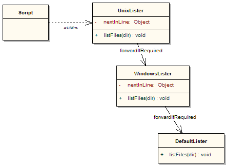

//////////////////////////////////////////

  Licensed to the Apache Software Foundation (ASF) under one
  or more contributor license agreements.  See the NOTICE file
  distributed with this work for additional information
  regarding copyright ownership.  The ASF licenses this file
  to you under the Apache License, Version 2.0 (the
  "License"); you may not use this file except in compliance
  with the License.  You may obtain a copy of the License at

    http://www.apache.org/licenses/LICENSE-2.0

  Unless required by applicable law or agreed to in writing,
  software distributed under the License is distributed on an
  "AS IS" BASIS, WITHOUT WARRANTIES OR CONDITIONS OF ANY
  KIND, either express or implied.  See the License for the
  specific language governing permissions and limitations
  under the License.

//////////////////////////////////////////

= Chain of Responsibility Pattern

In the Chain of Responsibility Pattern, objects using and implementing an interface (one or more methods) are intentionally loosely coupled. A set of objects that __implement__ the interface are organised in a list (or in rare cases a tree). Objects using the interface make requests from the first __implementor__ object. It will decide whether to perform any action itself and whether to pass the request further down the line in the list (or tree). Sometimes a default implementation for some request is also coded into the pattern if none of the implementors respond to the request.

== Example

In this example, the script sends requests to the `lister` object. The `lister` points to a `UnixLister` object. If it can't handle the request, it sends the request to the `WindowsLister`. If it can't handle the request, it sends the request to the `DefaultLister`.

[source,groovy]
----
include::{includedir}/../test/DesignPatternsTest.groovy[tags=chain_of_responsibility,indent=0]
----

The output will be a list of files (with slightly different format depending on the operating system).

Here is a UML representation:

Variations to this pattern:

* we could have an explicit interface, e.g. `Lister`, to statically type the implementations but because of _duck-typing_ this is optional
* we could use a chain tree instead of a list, e.g. `if (animal.hasBackbone())` delegate to `VertebrateHandler` else delegate to `InvertebrateHandler`
* we could always pass down the chain even if we processed a request
* we could decide at some point to not respond and not pass down the chain
* we could use Groovy’s meta-programming capabilities to pass unknown methods down the chain