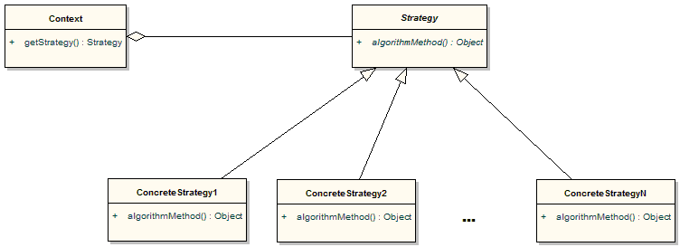

//////////////////////////////////////////

  Licensed to the Apache Software Foundation (ASF) under one
  or more contributor license agreements.  See the NOTICE file
  distributed with this work for additional information
  regarding copyright ownership.  The ASF licenses this file
  to you under the Apache License, Version 2.0 (the
  "License"); you may not use this file except in compliance
  with the License.  You may obtain a copy of the License at

    http://www.apache.org/licenses/LICENSE-2.0

  Unless required by applicable law or agreed to in writing,
  software distributed under the License is distributed on an
  "AS IS" BASIS, WITHOUT WARRANTIES OR CONDITIONS OF ANY
  KIND, either express or implied.  See the License for the
  specific language governing permissions and limitations
  under the License.

//////////////////////////////////////////

= Strategy Pattern

The http://en.wikipedia.org/wiki/Strategy_pattern[Strategy Pattern] allows you to abstract away particular algorithms from their usage. This allows you to easily swap the algorithm being used without having to change the calling code. The general form of the pattern is:

In Groovy, because of its ability to treat code as a first class object using anonymous methods (which we loosely call __Closures__), the need for the strategy pattern is greatly reduced. You can simply place algorithms inside Closures.

== Example

First let's look at the traditional way of encapsulating the Strategy Pattern.

[source,groovy]
----
include::{includedir}/../test/DesignPatternsTest.groovy[tags=strategy_traditional,indent=0]
----

Here we have defined an interface `Calc` which our concrete strategy classes will implement (we could also have used an abstract class). We then defined two algorithms for doing simple multiplication: `CalcByMult` the normal way, and ++CalcByManyAdds++ using only addition (don't try this one using negative numbers - yes we could fix this but it would just make the example longer). We then use normal http://en.wikipedia.org/wiki/Polymorphism_in_object-oriented_programming[polymorphism] to invoke the algorithms.

Here is the Groovier way to achieve the same thing using Closures:

[source,groovy]
----
include::{includedir}/../test/DesignPatternsTest.groovy[tags=strategy_groovy_way,indent=0]
----

