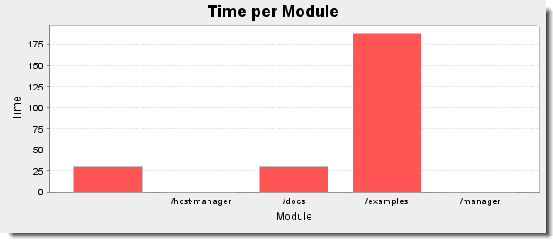
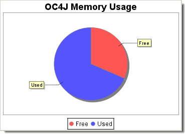

= Working with JMX
:toc:
:icons: font
:linkcss!:

== Introduction

Given that Groovy sits directly on top of Java, Groovy can leverage the tremendous amount of work already done for http://www.oracle.com/technetwork/java/javase/tech/javamanagement-140525.html[JMX] with Java. In addition, Groovy provides a ++GroovyMBean++ class which makes an MBean look like a normal Groovy object. This simplifies Groovy code for interacting with __MBeans__. For example, the following code:

[source,groovy]
----
include::../test/JmxTest.groovy[tags=introduction_example,indent=0]
----

can be simplified to:

[source,groovy]
----
include::../test/JmxTest.groovy[tags=introduction_simplified_example,indent=0]
----

The remainder of this page shows you how to:

- Monitor the JVM using MXBeans
- Monitor Apache Tomcat and display statistics
- Monitor Oracle OC4J and display information
- Monitor BEA WebLogic and display information
- Leverage Spring's MBean annotation support to export your Groovy beans as MBeans

Note: many of the examples on this page use Java 5 which incorporates JMX 1.2 (more recent versions if JMX or Java will also work). In some cases, you can run some of these examples using Java 1.4 by including a version of JMX on your ++CLASSPATH++. MX4J is bundled with the full distribution of Groovy. In most cases, you can delete this jar from your distribution ++lib++ directory if you are running with Java 5 or above (in fact you might have to - see the Troubleshooting section below).

== Monitoring the JVM

MBeans are not accessed directly by an application but are managed by a repository called an __MBean server__. Java 5 and above includes a special MBean server called the __platform MBean server__, which is built into the JVM. Platform MBeans are registered in this server using unique names.

You can monitor the JVM through its platform MBeans with the following code:

[source,groovy]
----
include::../test/JmxTest.groovy[tags=the_jvm,indent=0]
----

When run, you will see something like this:

----
OPERATING SYSTEM:
	architecture = x86
	name = Windows XP
	version = 5.1
	processors = 2

RUNTIME:
	name = 620@LYREBIRD
	spec name = Java Virtual Machine Specification
	vendor = Sun Microsystems Inc.
	spec version = 1.0
	management spec version = 1.0

CLASS LOADING SYSTEM:
	isVerbose = false
	loadedClassCount = 919
	totalLoadedClassCount = 919
	unloadedClassCount = 0

COMPILATION:
	totalCompilationTime = 91

MEMORY:
HEAP STORAGE:
	committed = 3108864
	init = 0
	max = 66650112
	used = 1994728
NON-HEAP STORAGE:
	committed = 9240576
	init = 8585216
	max = 100663296
	used = 5897880

	name: Code Cache
		Manager Name: CodeCacheManager
		mtype = Non-heap memory
		Usage threshold supported = true
	name: Eden Space
		Manager Name: MarkSweepCompact
		Manager Name: Copy
		mtype = Heap memory
		Usage threshold supported = false
	name: Survivor Space
		Manager Name: MarkSweepCompact
		Manager Name: Copy
		mtype = Heap memory
		Usage threshold supported = false
	name: Tenured Gen
		Manager Name: MarkSweepCompact
		mtype = Heap memory
		Usage threshold supported = true
	name: Perm Gen
		Manager Name: MarkSweepCompact
		mtype = Non-heap memory
		Usage threshold supported = true

THREADS:
	Thread name = Monitor Ctrl-Break
	Thread name = Signal Dispatcher
	Thread name = Finalizer
	Thread name = Reference Handler
	Thread name = main

GARBAGE COLLECTION:
	name = Copy
		collection count = 60
		collection time = 141
		mpool name = Eden Space
		mpool name = Survivor Space
	name = MarkSweepCompact
		collection count = 0
		collection time = 0
		mpool name = Eden Space
		mpool name = Survivor Space
		mpool name = Tenured Gen
		mpool name = Perm Gen
----

== Monitoring Tomcat

First start up http://tomcat.apache.org[Tomcat] with JMX monitoring enabled by setting the following:

[source,shell]
----
set JAVA_OPTS=-Dcom.sun.management.jmxremote -Dcom.sun.management.jmxremote.port=9004\
 -Dcom.sun.management.jmxremote.authenticate=false -Dcom.sun.management.jmxremote.ssl=false
----

You can do this in your startup script and may choose any available port, we used 9004.

The following code uses JMX to discover the available MBeans in the running Tomcat, determine which are web modules, extract the processing time for each web module and displays the result in a graph using JFreeChart:

[source,groovy]
----
include::../test/JmxTest.groovy[tags=tomcat,indent=0]
----

When run, we will see a trace of progress being made:

----
Connected to: Apache Tomcat/6.0.13
Found 5 web modules. Processing ...
Catalina:j2eeType=WebModule,name=//localhost/,J2EEApplication=none,J2EEServer=none
Catalina:j2eeType=WebModule,name=//localhost/host-manager,J2EEApplication=none,J2EEServer=none
Catalina:j2eeType=WebModule,name=//localhost/docs,J2EEApplication=none,J2EEServer=none
Catalina:j2eeType=WebModule,name=//localhost/examples,J2EEApplication=none,J2EEServer=none
Catalina:j2eeType=WebModule,name=//localhost/manager,J2EEApplication=none,J2EEServer=none
----

The output will look like this:

Note: if you get errors running this script, see the **Troubleshooting** section below.

== OC4J Example

Here is a script to access http://www.oracle.com/technology/products/oc4j[OC4J] and print out some information about the server, its runtime and (as an example) the configured JMS destinations:

[source,groovy]
----
import javax.management.remote.*
import oracle.oc4j.admin.jmx.remote.api.JMXConnectorConstant

def serverUrl = new JMXServiceURL('service:jmx:rmi://localhost:23791')
def serverPath = 'oc4j:j2eeType=J2EEServer,name=standalone'
def jvmPath = 'oc4j:j2eeType=JVM,name=single,J2EEServer=standalone'
def provider = 'oracle.oc4j.admin.jmx.remote'
def credentials = [
    (JMXConnectorConstant.CREDENTIALS_LOGIN_KEY): 'oc4jadmin',
    (JMXConnectorConstant.CREDENTIALS_PASSWORD_KEY): 'admin'
]
def env = [
    (JMXConnectorFactory.PROTOCOL_PROVIDER_PACKAGES): provider,
    (JMXConnector.CREDENTIALS): credentials
]
def server = JmxFactory.connect(serverUrl, env).MBeanServerConnection
def serverInfo = new GroovyMBean(server, serverPath)
def jvmInfo = new GroovyMBean(server, jvmPath)
println """Connected to $serverInfo.node. \
Server started ${new Date(serverInfo.startTime)}.
OC4J version:  $serverInfo.serverVersion from $serverInfo.serverVendor
JVM version:   $jvmInfo.javaVersion from $jvmInfo.javaVendor
Memory usage:  $jvmInfo.freeMemory bytes free, \
$jvmInfo.totalMemory bytes total
"""

def query = new javax.management.ObjectName('oc4j:*')
String[] allNames = server.queryNames(query, null)
def dests = allNames.findAll { name ->
    name.contains('j2eeType=JMSDestinationResource')
}.collect { new GroovyMBean(server, it) }

println "Found ${dests.size()} JMS destinations. Listing ..."
dests.each { d -> println "$d.name: $d.location" }
----

Here is the result of running this script:

----
Connected to LYREBIRD. Server started Thu May 31 21:04:54 EST 2007.
OC4J version:  11.1.1.0.0 from Oracle Corp.
JVM version:   1.6.0_01 from Sun Microsystems Inc.
Memory usage:  8709976 bytes free, 25153536 bytes total

Found 5 JMS destinations. Listing ...
Demo Queue: jms/demoQueue
Demo Topic: jms/demoTopic
jms/Oc4jJmsExceptionQueue: jms/Oc4jJmsExceptionQueue
jms/RAExceptionQueue: jms/RAExceptionQueue
OracleASRouter_store: OracleASRouter_store
----

As a slight variation, this script displays a pie chart of memory usage using JFreeChart:

[source,groovy]
----
import org.jfree.chart.ChartFactory
import javax.swing.WindowConstants as WC
import javax.management.remote.*
import oracle.oc4j.admin.jmx.remote.api.JMXConnectorConstant

def url = 'service:jmx:rmi://localhost:23791'
def credentials = [:]
credentials[JMXConnectorConstant.CREDENTIALS_LOGIN_KEY] = "oc4jadmin"
credentials[JMXConnectorConstant.CREDENTIALS_PASSWORD_KEY] = "password"
def env = [:]
env[JMXConnectorFactory.PROTOCOL_PROVIDER_PACKAGES] = "oracle.oc4j.admin.jmx.remote"
env[JMXConnector.CREDENTIALS] = credentials
def server = JMXConnectorFactory.connect(new JMXServiceURL(url), env).MBeanServerConnection
def jvmInfo = new GroovyMBean(server, 'oc4j:j2eeType=JVM,name=single,J2EEServer=standalone')

def piedata = new org.jfree.data.general.DefaultPieDataset()
piedata.setValue "Free", jvmInfo.freeMemory
piedata.setValue "Used", jvmInfo.totalMemory - jvmInfo.freeMemory

def options = [true, true, true]
def chart = ChartFactory.createPieChart('OC4J Memory Usage', piedata, *options)
chart.backgroundPaint = java.awt.Color.white
def swing = new groovy.swing.SwingBuilder()
def frame = swing.frame(title:'OC4J Memory Usage', defaultCloseOperation:WC.EXIT_ON_CLOSE) {
    panel(id:'canvas') { rigidArea(width:350, height:250) }
}
frame.pack()
frame.show()
chart.draw(swing.canvas.graphics, swing.canvas.bounds)
----

Which looks like:

== WebLogic Example

This script prints out information about the server followed by information about JMS Destinations (as an example). Many other mbeans are http://docs.oracle.com/cd/E13222_01/wls/docs90/wlsmbeanref/core/index.html[available].

[source,groovy]
----
include::../test/JmxTest.groovy[tags=weblogic,indent=0]
----

Here is the output:

----
Server: name=examplesServer, state=RUNNING, version=WebLogic Server 10.0  Wed May 9 18:10:27 EDT 2007 933139
JMS Destination: name=examples-jms!exampleTopic, type=Topic, messages=0
JMS Destination: name=examples-jms!exampleQueue, type=Queue, messages=0
JMS Destination: name=examples-jms!jms/MULTIDATASOURCE_MDB_QUEUE, type=Queue, messages=0
JMS Destination: name=examplesJMSServer!examplesJMSServer.TemporaryQueue0, type=Queue, messages=68
JMS Destination: name=examples-jms!quotes, type=Topic, messages=0
JMS Destination: name=examples-jms!weblogic.wsee.wseeExamplesDestinationQueue, type=Queue, messages=0
JMS Destination: name=examples-jms!weblogic.examples.ejb30.ExampleQueue, type=Queue, messages=0
----

== Spring Example

You can also use Spring to automatically register beans as JMX aware.

Here is an example class (Calculator.groovy):

[source,groovy]
----
include::../test/JmxTest.groovy[tags=spring_classes,indent=0]
----

Here is the Spring configuration file (beans.xml):

[source,xml]
----
<?xml version="1.0" encoding="UTF-8"?>
<beans xmlns="http://www.springframework.org/schema/beans"
       xmlns:xsi="http://www.w3.org/2001/XMLSchema-instance"
       xsi:schemaLocation="
http://www.springframework.org/schema/beans http://www.springframework.org/schema/beans/spring-beans.xsd">
    <bean id="mbeanServer"
          class="org.springframework.jmx.support.MBeanServerFactoryBean">
        <property name="locateExistingServerIfPossible" value="true"/>
    </bean>

    <bean id="exporter"
          class="org.springframework.jmx.export.MBeanExporter">
        <property name="assembler" ref="assembler"/>
        <property name="namingStrategy" ref="namingStrategy"/>
        <property name="beans">
            <map>
                <entry key="bean:name=defaultCalcName" value-ref="calcBean"/>
            </map>
        </property>
        <property name="server" ref="mbeanServer"/>
        <property name="autodetect" value="true"/>
    </bean>

    <bean id="jmxAttributeSource"
          class="org.springframework.jmx.export.annotation.AnnotationJmxAttributeSource"/>

    <!-- will create management interface using annotation metadata -->
    <bean id="assembler"
          class="org.springframework.jmx.export.assembler.MetadataMBeanInfoAssembler">
        <property name="attributeSource" ref="jmxAttributeSource"/>
    </bean>

    <!-- will pick up the ObjectName from the annotation -->
    <bean id="namingStrategy"
          class="org.springframework.jmx.export.naming.MetadataNamingStrategy">
        <property name="attributeSource" ref="jmxAttributeSource"/>
    </bean>

    <bean id="calcBean"
          class="Calculator">
        <property name="base" value="10"/>
    </bean>
</beans>
----

Here is a script which uses this bean and configuration:

[source,groovy]
----
include::../test/JmxTest.groovy[tags=spring_usage,indent=0]
----

And here is the resulting output:

----
Number of invocations: 5
MBean Name:
  bean:name=calcMBean

Attributes:
  (rw) int Base
  (r) int Invocations
Operations:
  int add(int x, int y)
  java.lang.String addStrings(java.lang.String x, java.lang.String y)
  int getInvocations()
  int getBase()
  void setBase(int p1)
----

You can even attach to the process while it is running with http://docs.oracle.com/javase/1.5.0/docs/guide/management/jconsole.html[jconsole]. It will look something like:

image:assets/img/jconsole.gif[]

We started the Groovy application with the ++-Dcom.sun.management.jmxremote++ JVM argument using a Java 5 JVM.

See also:

- <<_dynamic-language-beans-in-spring,Dynamic language beans in Spring>>
- <<_using-spring-factories-with-groovy,Using Spring Factories with Groovy>>
- http://static.springsource.org/spring/docs/3.2.x/spring-framework-reference/html/jmx.html[Spring JMX Documentation]

== Troubleshooting

=== groovy.lang.MissingMethodException or groovy.lang.GroovyRuntimeException

If you get an error like this:

----
groovy.lang.MissingMethodException: No signature of method:
javax.management.remote.rmi.RMIConnector$RemoteMBeanServerConnection.queryMBeans()
is applicable for argument types: (javax.management.ObjectName, null)
values: {Catalina:*, null}
----

or like this:

----
Caught: groovy.lang.GroovyRuntimeException: Could not find matching constructor for: groovy.util.GroovyMBean(javax.management.remote.rmi.RMIConnector$RemoteMBeanServerConnection, java.lang.String)
----

you have to move away or delete "mx4j-*.jar" from ++$GROOVY_HOME/lib++. MX4J is designed to add ++javax.management++ classes to 1.4 JVMs. If you already have a newer JMX jar on your classpath or are using a Java 5 or higher JVM, the MX4J classes will be incompatible with the ones from the newer Sun JVMs or newer versions of JMX.

=== java.lang.SecurityException

If you get the following error, your container's JMX access is password protected:

----
java.lang.SecurityException: Authentication failed! Credentials required
----

To fix that, add an environment with the credentials when connecting, like this (password has to be set before that):

[source,groovy]
----
include::../test/JmxTest.groovy[tags=troubleshooting,indent=0]
----

Details for the software you are trying to monitor/manage may differ slightly. Check out the other examples using credentials above if appropriate (e.g. OC4J and WebLogic). If you still have troubles, you will have to consult the documentation for the software you are trying to monitor/manage for details on how to provide credentials.

== Further JMX Information

- <<_jmxbuilder,Groovy JmxBuilder>>
- http://www.ddj.com/dept/java/184406481?pgno=1[Monitoring the Java Virtual Machine]
- http://buttso.blogspot.com/2006/05/using-groovy-for-system-management.html[Using Groovy for System Management]
- http://jmesnil.net/weblog/2007/03/23/jmx-scripts-using-jruby[JMX Scripts using JRuby - Part I]
- http://jmesnil.net/weblog/2007/04/03/jmx-scripts-using-jruby-part-ii[JMX Scripts using JRuby - Part II]
- https://blogs.oracle.com/sundararajan/entry/groovier_jconsole[Groovier jconsole!]
- http://jmesnil.net/weblog/2007/05/23/jmx-scripts-with-eclipse-monkey[JMX Scripts with Eclipse Monkey]
- http://activemq.apache.org/jmx.html[Using JMX to monitor Apache ActiveMQ]
- http://jagger.berlios.de[Jagger project (JMX application monitoring with Groovy)]