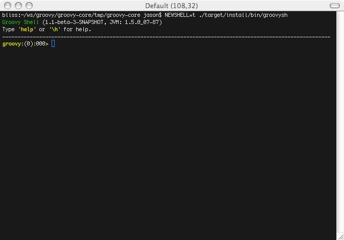
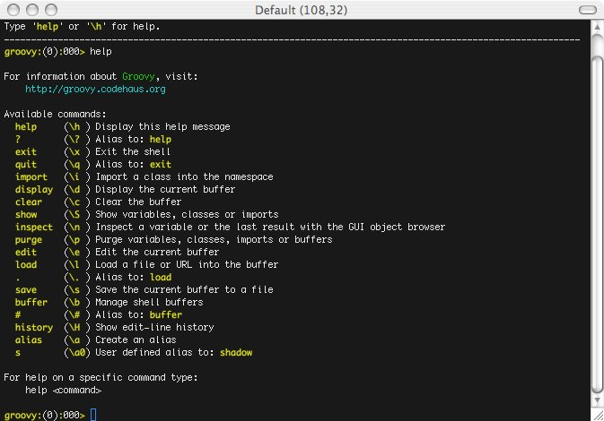
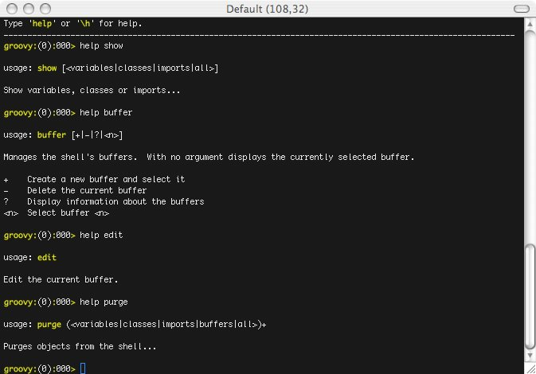

= groovysh, the Groovy shell

== Groovy : Groovy Shell

The Groovy Shell, aka. `groovysh` is a command-line application which
allows easy access to evaluate Groovy expressions, define classes and
run simple experiments.

[[GroovyShell-Features]]
=== Features

* No need for `go` command to execute buffer.
* Rich cross-platform edit-line editing, history and completion thanks
to http://jline.sf.net[JLine].
* ANSI colors (prompt, exception traces, etc).
* Simple, yet robust, command system with online help, user alias
support and more.
* User profile support

[[GroovyShell-Command-lineOptionsandArguments]]
=== Command-line Options and Arguments

The shell supports several options to control verbosity, ANSI coloring
and other features.

[source,groovy]
-----------------------------------------------------------------
./bin/groovysh --help
usage: groovysh [options] [...]
  -C, --color[=FLAG]         Enable or disable use of ANSI colors
  -D, --define=NAME=VALUE    Define a system property
  -T, --terminal=TYPE        Specify the terminal TYPE to use
  -V, --version              Display the version
  -d, --debug                Enable debug output
  -h, --help                 Display this help message
  -q, --quiet                Suppress superfluous output
  -v, --verbose              Enable verbose output
-----------------------------------------------------------------

In addition to options, commands or expressions can be given on the
command-line which will invoke the shell in non-interactive mode. The
commands or expressions will be evaluated and the shell will exit. If no
additional arguments are given the shell will startup interactively.

[[GroovyShell-ExecuteaCommand]]
==== Execute a Command

---------------------------------
./bin/groovysh 'show preferences'
No preferences are set
---------------------------------

[[GroovyShell-EvaluateanExpression]]
==== Evaluate an Expression

--------------------------------------------------------------------------------------------
./bin/groovysh 'System.properties.each { k, v -> println("$k = $v") }'
java.runtime.name = Java(TM) 2 Runtime Environment, Standard Edition
sun.boot.library.path = /System/Library/Frameworks/JavaVM.framework/Versions/1.5.0/Libraries
java.vm.version = 1.5.0_07-87
awt.nativeDoubleBuffering = true
gopherProxySet = false
...
--------------------------------------------------------------------------------------------

[[GroovyShell-EvaluatingExpressions]]
=== Evaluating Expressions

[[GroovyShell-SimpleExpressions]]
==== Simple Expressions

[source,groovy]
---------------
println "Hello"
---------------

[[GroovyShell-EvaluationResult]]
==== Evaluation Result

When a complete expression is found, it is compiled and evaluated. The
result of the evaluation is stored into the _ variable.

[[GroovyShell-Multi-lineExpressions]]
==== Multi-line Expressions

Multi-line/complex expressions (like closure or class definitions) may
be defined over several lines. When the shell detects that it has a
complete expression it will compile and evaluate it.

[[GroovyShell-DefineaClass]]
===== Define a Class

[source,groovy]
---------------------
class Foo {
    def bar() {
        println "baz"
    }
}
---------------------

[[GroovyShell-UsetheClass]]
===== Use the Class

[source,groovy]
---------------
foo = new Foo()
foo.bar()
---------------

[[GroovyShell-Variables]]
==== Variables

Shell variables are *all* untyped (ie. no `def` or other type
information).

This *will* set a shell variable:

[source,groovy]
-----------
foo = "bar"
-----------

But, this will evaluate a local variable and will *not* be saved to the
shell’s environment:

[source,groovy]
---------------
def foo = "bar"
---------------

[[GroovyShell-Functions]]
==== Functions

Functions can be defined in the shell, and will be saved for later use.

Defining a function is easy:

[source,groovy]
----------------------------------
groovy:000> def hello(name) {
groovy:001> println("Hello $name")
groovy:002> }
----------------------------------

And then using it is as one might expect:

[source,groovy]
--------------
hello("Jason")
--------------

Internally the shell creates a closure to encapsulate the function and
then binds the closure to a variable. So variables and functions share
the same namespace.

[[GroovyShell-Commands]]
=== Commands

The shell has a number of different commands, which provide rich access
to the shell’s environment.

Commands all have a _name_ and a _shortcut_ (which is something like
`\h`). Commands may also have some predefined system _aliases_. Users
may also create their own aliases.

[[GroovyShell-RecognizedCommands]]
==== Recognized Commands

[[GroovyShell-help]]
===== `help`

Display the list of commands (and aliases) or the help text for specific
command.

[[GroovyShell-TheCommandList]]
The Command List

----------------------------------------------------------------------------------
groovy:000> help

For information about Groovy, visit:
    http://groovy.codehaus.org

Available commands:
  help      (\h ) Display this help message
  ?         (\? ) Alias to: help
  exit      (\x ) Exit the shell
  quit      (\q ) Alias to: exit
  import    (\i ) Import a class into the namespace
  display   (\d ) Display the current buffer
  clear     (\c ) Clear the buffer and reset the prompt counter.
  show      (\S ) Show variables, classes or imports
  inspect   (\n ) Inspect a variable or the last result with the GUI object browser
  purge     (\p ) Purge variables, classes, imports or preferences
  edit      (\e ) Edit the current buffer
  load      (\l ) Load a file or URL into the buffer
  .         (\. ) Alias to: load
  save      (\s ) Save the current buffer to a file
  record    (\r ) Record the current session to a file
  history   (\H ) Display, manage and recall edit-line history
  alias     (\a ) Create an alias
  set       (\= ) Set (or list) preferences
  register  (\rc) Registers a new command with the shell
  doc       (\D ) Opens a browser window displaying the doc for the argument

For help on a specific command type:
    help <command>
----------------------------------------------------------------------------------

[[GroovyShell-HelpforaCommand]]
Help for a Command

While in the interactive shell, you can ask for help for any command to
get more details about its syntax or function. Here is an example of
what happens when you ask for help for the `help` command:

------------------------------------------------------------
groovy:000> help help

usage: help [<command>]

Display the list of commands or the help text for <command>.
------------------------------------------------------------

[[GroovyShell-exit]]
===== `exit`

Exit the shell.

This is the *only* way to exit the shell. Well, you can still `CTRL-C`,
but the shell will complain about an abnormal shutdown of the JVM.

[[GroovyShell-import]]
===== `import`

Add a custom import which will be included for all shell evaluations.

This command can be given at any time to add new imports.

[[GroovyShell-display]]
===== `display`

Display the contents of the current buffer.

This only displays the buffer of an incomplete expression. Once the
expression is complete, the buffer is rest. The prompt will update to
show the size of the current buffer as well.

[[GroovyShell-Example]]
Example

-----------------------
groovy:000> class Foo {
groovy:001> def bar
groovy:002> def baz() {
groovy:003> display
 001> class Foo {
 002> def bar
 003> def baz() {
-----------------------

[[GroovyShell-clear]]
===== `clear`

Clears the current buffer, resetting the prompt counter to 000. Can be used to recover from compilation errors.

[[GroovyShell-show]]
===== `show`

Show variables, classes or preferences or imports.

[[GroovyShell-showvariables]]
`show variables`

--------------------------
groovy:000> show variables
Variables:
  _ = true
--------------------------

[[GroovyShell-showclasses]]
`show classes`

[[GroovyShell-showimports]]
`show imports`

[[GroovyShell-showpreferences]]
`show preferences`

[[GroovyShell-showall]]
`show all`

[[GroovyShell-inspect]]
===== `inspect`

Opens the GUI object browser to inspect a variable or the result of the
last evaluation.

[[GroovyShell-purge]]
===== `purge`

Purges objects from the shell.

[[GroovyShell-purgevariables]]
`purge variables`

[[GroovyShell-purgeclasses]]
`purge classes`

[[GroovyShell-purgeimports]]
`purge imports`

[[GroovyShell-purgepreferences]]
`purge preferences`

[[GroovyShell-purgeall]]
`purge all`

[[GroovyShell-edit]]
===== `edit`

Edit the current buffer in an external editor.

Currently only works on UNIX systems which have the `EDITOR` environment
variable set, or have configured the `editor` preference.

[[GroovyShell-load]]
===== `load`

Load one or more files (or urls) into the buffer.

[[GroovyShell-save]]
===== `save`

Saves the buffer’s contents to a file.

[[GroovyShell-record]]
===== `record`

Record the current session to a file.

[[GroovyShell-recordstart]]
`record start`

[[GroovyShell-recordstop]]
`record stop`

[[GroovyShell-recordstatus]]
`record status`

[[GroovyShell-history]]
===== `history`

Display, manage and recall edit-line history.

[[GroovyShell-historyshow]]
`history show`

[[GroovyShell-historyrecall]]
`history recall`

[[GroovyShell-historyflush]]
`history flush`

[[GroovyShell-historyclear]]
`history clear`

[[GroovyShell-alias]]
===== `alias`

Create an alias.

[[GroovyShell-doc]]
===== `doc`

Opens a browser with documentation for the provided class. For example:

----
doc java.net.URL
----

will open two windows (or tabs, depending on your browser):

* one for the JDK documentation
* one for the GDK documentation

[[GroovyShell-set]]
===== `set`

Set or list preferences.

[[GroovyShell-Preferences]]
=== Preferences

Some of aspects of `groovysh` behaviors can be customized by setting
preferences. Preferences are set using the `set` command or the `\=`
shortcut.

[[GroovyShell-RecognizedPreferences]]
==== Recognized Preferences

[[GroovyShell-verbosity]]
===== `verbosity`

Set the shell’s verbosity level. Expected to be one of:

* `DEBUG`
* `VERBOSE`
* `INFO`
* `QUIET`

Default is `INFO`.

If this preference is set to an invalid value, then the previous setting
will be used, or if there is none, then the preference is removed and
the default is used.

[[GroovyShell-show-last-result]]
===== `show-last-result`

Show the last result after an execution.

Default is `true`.

[[GroovyShell-sanitize-stack-trace]]
===== `sanitize-stack-trace`

Sanitize (trim-down/filter) stack traces.

Default is `true`.

[[GroovyShell-editor]]
===== `editor`

Configures the editor used by the `edit` command.

Default is the value of the system environment variable `EDITOR`.

Mac OS XTo use TextEdit, the default text editor on Mac OS X, configure:
set editor /Applications/TextEdit.app/Contents/MacOS/TextEdit

[[GroovyShell-SettingaPreference]]
==== Setting a Preference

-------------------
set verbosity DEBUG
-------------------

[[GroovyShell-ListingPreferences]]
==== Listing Preferences

To list the current _set_ preferences (and their values):

----------------
show preferences
----------------

LimitationAt the moment, there is no way to list all of the
known/available preferences to be set.

[[GroovyShell-ClearingPreferencesieResettingtoDefaults]]
==== Clearing Preferences (ie. Resetting to Defaults)

-----------------
purge preferences
-----------------

[[GroovyShell-UserProfileScriptsandState]]
=== User Profile Scripts and State

[[GroovyShell-ProfileScripts]]
==== Profile Scripts

[[GroovyShell-HOMEgroovygroovyshprofile]]
===== `$HOME/.groovy/groovysh.profile`

This script, if it exists, is loaded when the shell starts up.

[[GroovyShell-HOMEgroovygroovyshrc]]
===== `$HOME/.groovy/groovysh.rc`

This script, if it exists, is loaded when the shell enters interactive
mode.

[[GroovyShell-State]]
==== State

[[GroovyShell-HOMEgroovygroovyshhistory]]
===== `$HOME/.groovy/groovysh.history`

Edit-line history is stored in this file.

[[GroovyShell-register]]
=== Custom commands

The `register` command allows you to register custom commands in the shell. For example, writing the following
will register the `Stats` command:

----
register Stats
----

where the `Stats` class is a class extending the `org.codehaus.groovy.tools.shell.CommandSupport` class. For example:

[source,groovy]
----
import org.codehaus.groovy.tools.shell.CommandSupport
import org.codehaus.groovy.tools.shell.Groovysh

class Stats extends CommandSupport {
    protected Stats(final Groovysh shell) {
        super(shell, 'stats', 'T')
    }

    public Object execute(List args) {
        println "Free memory: ${Runtime.runtime.freeMemory()}"
    }

}
----

Then the command can be called using:

----
groovy:000> stats
stats
Free memory: 139474880
groovy:000>
----

Note that the command class must be found on classpath: you cannot define a new command from within the shell.

[[GroovyShell-ScreenShots]]
=== Screen Shots

These shots have been taken over the development of the new shell, so
some of the content might look slightly different. Also, note the yellow
colors here are the shell’s _bold_ color, so the colors might look
different depending on how the enclosing shell has its colors setup.

[[GroovyShell-Troubleshooting]]
=== Troubleshooting

Please http://jira.codehaus.org/browse/GROOVY[report] any problems you
run into. Please be sure to mark the JIRA issue with the `Groovysh`
component.

[[GroovyShell-PlatformProblems]]
==== Platform Problems

[[GroovyShell-ProblemsloadingtheJLineDLL]]
===== Problems loading the JLine DLL

On Windows, http://jline.sf.net[JLine] (which is used for the fancy
shell input/history/completion fluff), uses a *tiny* DLL file to trick
the *evil* Windows faux-shell (`CMD.EXE` or `COMMAND.COM`) into
providing Java with unbuffered input. In some rare cases, this might
fail to load or initialize.

One solution is to disable the frills and use the unsupported terminal
instance. You can do that on the command-line using the `--terminal`
flag and set it to one of:

* `none`
* `false`
* `off`
* `jline.UnsupportedTerminal`

------------------------
groovysh --terminal=none
------------------------

[[GroovyShell-ProblemswithCygwinonWindows]]
===== Problems with Cygwin on Windows
as
Some people have issues when running groovysh with cygwin. If you have
troubles, the following may help:

------------------------
stty -icanon min 1 -echo
groovysh --terminal=unix
stty icanon echo
------------------------

:leveloffset: 2