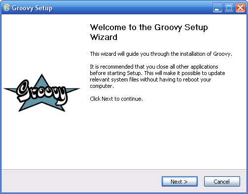
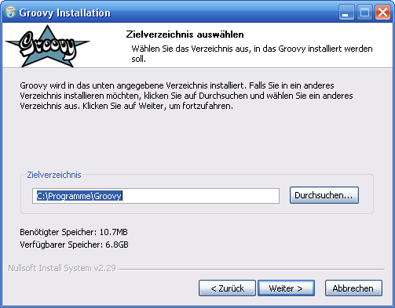
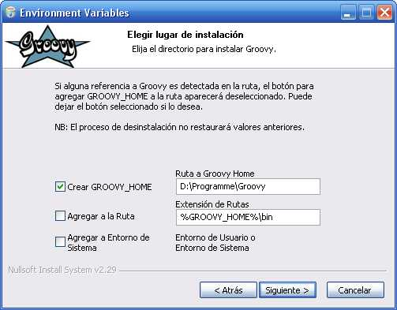
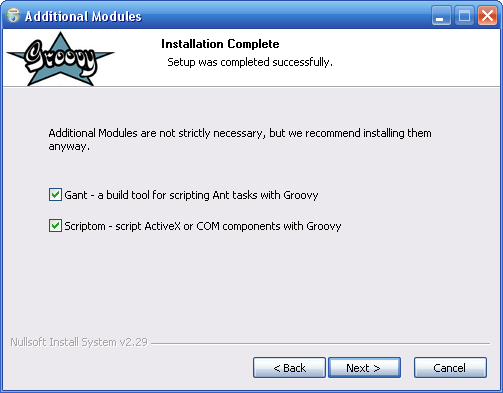
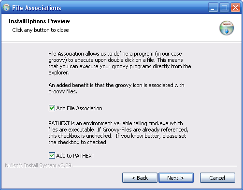

//////////////////////////////////////////

  Licensed to the Apache Software Foundation (ASF) under one
  or more contributor license agreements.  See the NOTICE file
  distributed with this work for additional information
  regarding copyright ownership.  The ASF licenses this file
  to you under the Apache License, Version 2.0 (the
  "License"); you may not use this file except in compliance
  with the License.  You may obtain a copy of the License at

    http://www.apache.org/licenses/LICENSE-2.0

  Unless required by applicable law or agreed to in writing,
  software distributed under the License is distributed on an
  "AS IS" BASIS, WITHOUT WARRANTIES OR CONDITIONS OF ANY
  KIND, either express or implied.  See the License for the
  specific language governing permissions and limitations
  under the License.

//////////////////////////////////////////

= Windows NSIS-Installer

== A Windows-specific installation script

That allows to create installer. You can examine the results on the https://groovy.apache.org/download.html[download page].

The installer first copies the groovy files to where the user wants,

then asks for permission to create a variable `GROOVY_HOME` and to add the respective bin directory (`%GROOVY_HOME%/bin` to the path, if no reference to groovy already exists in it.

The user can decide whether to put these into the user or system environment (on Win 95 and Win 98 this information is appended to the autoexec.bat instead) i.e., whether the installation will be for the current user or for all users. Then the installer checks for the existence of `JAVA_HOME`. If it doesn't exist, a message box points out the potential problem.

Next the user can decide whether or not to install the native launcher,

image::assets/img/native.jpg[]

can decide to install additional packages,

and finally whether to associate .groovy files with the native launcher, and whether to add the extension .groovy and .gy to ++PATHEXT++. This allows to start Groovy files from the command line directly, without having to call the groovy explicitly.

As you can see in the screen shots (they are clickable thumbnails), currently english, german, french and spanish are supported as installation languages.

Oh, and whatever you do, do not use the command line option -russel.

The french translation has been contributed by Xavier Mehaut and Tugduall Grall, the spanish translation by Andres Almiray, and the translation to brazilian portuguese has been provided by Marcos Silva Pereira.

Thank you very much for your help.

=== Silent installation

The installer supports silent installation with the command line option /S. When using this option you can influence which parts are installed using additional options:

[cols="1,2" options="header"]
|===
|Option
|Function

|/A
|Install Additional Packages

|/ALL
|Install All

|/D
|Set Installation Directory (mandatory)

|/F
|Create File Associations

|/N
|Install Native Launcher

|/S
|Silent Install

|/V
|Set Variables
|===

The option /D is mandatory and points to the installation directory. It is important to note that the /D option **must** be the last parameter on the command line and must not contain any quotes, even if the path contains spaces. Only absolute paths are supported. Use an equal sign to separate the option and the path.

Example: ++groovy-1.5.6-installer-2.exe /S /A /N /D=d:\program files\groovy++

=== Working with the installer source

To use the installer source to create your own binary installers, simply check it out into an Eclipse workspace. Additionally you might want to install the http://nsis.sourceforge.net/EclipseNSIS_-_NSIS_plugin_for_Eclipse[NSIS-Eclipse-Plugin], it helps when developing NSIS stuff.

If you have worked with NSIS-scripts already there should be no big problem understanding what is done.

The main script is the file setup.nsi, where you can find the installer program. Three additional pages are defined, Variables, NativeLauncher and FileAssociation, and for each you can find the respective .ini file containing the screen placement. Simply open them in the design editor provided by the Eclipse-Plugin, and you can see what they look like.

Two bmp-images contain the Groovy logo in different resolutions, one for the welcome page and one as header image for the other pages. The name is the game ...

Finally you have the launch scripts. These actually start the compiler with different settings for the groovy version, the groovy location (on your hard disk) and the location of the native launcher. The groovy version influences the final name of the installer.

The launch scripts are setting the following variables:

- **SOURCE_VERSION** defines the version of the release
- **SOURCE_DIR** is the full path to the groovy install directory
- **NATIVE_DIR** is the full path to the native launcher
- **SCRIPTOM_DIR** is the full path to the scriptom module
- **GANT_DIR** is the full path to the gant module
- **GRAPHICS_B** is the full path to the graphicsbuilder module
- **SWINGX_B** is the full path to the swingxbuilder module
- **VERSION_TXT** is the full path to the installed_versions.txt (this file describes the used versions)
- **DOC_DIR** is the full path to the doc directory

Most probably you only have to set these variables and you are happy to go.

Have fun.

If there is any problem whatsoever, either ask on the mailing lists or contact the author at

joachim.baumann_at_xinaris.de.

Excerpt:a Windows-specific installer for Groovy