//////////////////////////////////////////

  Licensed to the Apache Software Foundation (ASF) under one
  or more contributor license agreements.  See the NOTICE file
  distributed with this work for additional information
  regarding copyright ownership.  The ASF licenses this file
  to you under the Apache License, Version 2.0 (the
  "License"); you may not use this file except in compliance
  with the License.  You may obtain a copy of the License at

    http://www.apache.org/licenses/LICENSE-2.0

  Unless required by applicable law or agreed to in writing,
  software distributed under the License is distributed on an
  "AS IS" BASIS, WITHOUT WARRANTIES OR CONDITIONS OF ANY
  KIND, either express or implied.  See the License for the
  specific language governing permissions and limitations
  under the License.

//////////////////////////////////////////

= Groovysh, the Groovy shell

== Groovy : Groovy Shell

NOTE: The groovysh is undergoing a major re-vamp and some of this information may not yet have been updated to reflect the latest changes.

The Groovy Shell, aka. `groovysh` is a command-line application which
allows easy access to evaluate Groovy expressions, define classes and
run simple experiments.

[[GroovyShell-Features]]
=== Features

* Rich cross-platform line editing, history and completion thanks
to https://github.com/jline/jline3[JLine3].
* ANSI colors (prompt, exception traces, etc).
* Simple, yet robust, command system with online help, user alias
support and more.
* User profile support

[[GroovyShell-Command-lineOptionsandArguments]]
=== Command-line Options and Arguments

The shell supports several options to control verbosity, ANSI coloring
and other features.

[source,shell]
-----------------------------------------------------------------
./bin/groovysh --help

Usage: groovysh [options] [...]
The Groovy Shell, aka groovysh, is a command-line application which allows easy
access to evaluate Groovy expressions, define classes and run simple
experiments.
  -C, --color[=<FLAG>]    Enable or disable use of ANSI colors
      -cp, -classpath, --classpath
                          Specify where to find the class files - must be first
                            argument
  -d, --debug             Enable debug output
  -D, --define=<name=value>
                          Define a system property
  -e, --evaluate=<CODE>   Evaluate the code first when starting interactive session
  -h, --help              Display this help message
  -pa, --parameters       Generate metadata for reflection on method parameter names
                            (jdk8+ only)
  -pr, --enable-preview   Enable preview Java features (jdk12+ only)
  -q, --quiet             Suppress superfluous output
  -T, --terminal=<TYPE>   Specify the terminal TYPE to use
  -v, --verbose           Enable verbose output
  -V, --version           Display the version
-----------------------------------------------------------------

[[GroovyShell-Model]]
=== Repl model

The Groovy Shell is a Read-Eval-Print Loop (REPL) which allows you to
interactively evaluate Groovy expressions and statements,
define classes and other types, invoke commands, and run simple experiments.

When you input a line, the shell will try to determine if the input you
have given is a complete valid expression, statement, or definition.
If not complete, it will prompt you for more input.
If it is complete, it will execute the input, and print the result,
if any, to the console. Each input you enter is executed in isolation.

There are some exceptions to this conceptual model. Any import statements
entered will be remembered and used for all subsequent evaluations.
Similarly, with some caveats we'll discuss next, any previously defined classes, methods, and potentially variables will be available.

The shell has the concept of shared variables. Given that subsequent statements
are run in isolation, you should store any results needed for later use in shared variables.

Many Groovy tutorials and examples use the `def` keyword or a type to define variables.
Script examples might distinguish between local variables with a type and script
binding variables where no type, nor the `def` or `var` type placeholders,
are given. The script binding is the exact equivalent to the shell's shared variables.

Because such statements are so common, the shell has a special mode
called _interpreter mode_ which allows you to use typed variables.
The following table summarizes the differences between the two modes:

[options="header"]
|===
| interpreterMode | off | on
| imports 2+| remembered
| types 2+| available
| methods | converted to closure shared variables | remembered
| shared variables 2+| available
| local variables | forgotten | remembered
|===

Conceptually, for things that are _remembered_ in the above table,
it is as if you included the related code at the start of each of your inputs.

[NOTE]
--
You should treat local variables as if you were using immutable data structures.
An input which mutates a local variable will likely be undone by subsequent statements.
So, you should pick one of the first two styles below.

In either mode you can use shared variables:
[source,jshell]
----
groovy> fruit = []
groovy> fruit << 'peach'
[peach]
groovy> fruit << 'pear'
[peach, pear]
groovy> assert fruit == ['peach', 'pear']
----

Use the `/show` command to see the shared variables.

Only in interpreter mode:
[source,jshell]
----
groovy> def noFruit = []
[]
groovy> def oneFruit = noFruit << 'peach'
[peach]
groovy> def twoFruit = oneFruit << 'pear'
[peach, pear]
groovy> assert twoFruit == ['peach', 'pear']
----

By the time you get to the last statement, the previous three local variable
definitions are remembered, so the assertion will pass.

Avoid this (relevant to interpreter mode):
[source,jshell]
----
groovy> def fruit = []
[]
groovy> fruit << 'peach'
[peach]
groovy> fruit << 'pear'
[pear]
groovy> assert fruit == []
----
The `def fruit = []` will be _remembered_ before executing each of the next three statements.
--

The shell also has the concept of the "current buffer". This is the collection of all type,
method, imports, and variable definitions. The ordering of these snippets is retained,
which is important for the shell, since it is only executing one snippet at a time,
it typically requires everything needed for a snippet to be pre-defined.
This is different to a compiler which might compile multiple source files at once,
and resolve references between types as needed.

[[GroovyShell-EvaluatingExpressions]]
=== Evaluating Expressions

[[GroovyShell-SimpleExpressions]]
==== Simple Expressions

[source,jshell]
---------------
groovy> println "Hello"
Hello
---------------

[[GroovyShell-EvaluationResult]]
==== Evaluation Result

When a complete expression is found, it is compiled and evaluated. The
result of the evaluation is stored into the `_` variable.

[[GroovyShell-Multi-lineExpressions]]
==== Multi-line Expressions

Multi-line/complex expressions (like closure or class definitions) may
be defined over several lines. When the shell detects that it has a
complete expression it will compile and evaluate it.

[[GroovyShell-DefineaClass]]
===== Define a Class

You can define all the normal types, e.g. a class:

[source,jshell]
---------------------
groovy> class Foo {
add: } >   def bar() {
add: }}>     println "baz"
add: }}>   }
add: } > }
---------------------

And use it in the normal way.

[source,jshell]
---------------
groovy> foo = new Foo()
groovy> foo.bar()
baz
---------------

Defined classes are known to the shell and can be used in completion:

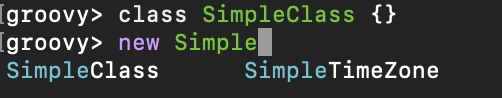

[[GroovyShell-VariablesandMethods]]

[[GroovyShell-Variables]]
==== Variables

Shell variables are *all* untyped (i.e. no `def` or other type information).

This *will* set a shell variable:

[source,groovy]
-----------
foo = "bar"
-----------

But, this will evaluate a local variable and will *not* be saved to the shell’s environment:

[source,groovy]
---------------
def foo = "bar"
---------------

This behavior can be changed by activating <<GroovyShell-InterpreterMode,interpreter mode>>.

[[GroovyShell-Methods]]
==== Methods

Methods can be defined in the shell, and will be saved for later use.

Defining a function is easy:

[source,jshell]
----------------------------------
groovy> def hello(name) {
add: }>   println("Hello $name")
add: }> }
----------------------------------

And then using it is as one might expect:

[source,jshell]
--------------
groovy> hello "Jason"
Hello Jason
--------------

Internally the shell creates a closure to encapsulate the function and
then binds the closure to a variable. So variables and functions share
the same namespace.

[[GroovyShell-Commands]]
=== Commands

The shell has a number of different commands, which provide rich access
to the shell’s environment.

Commands all have a _name_, e.g. `/help` and `/prnt`.
Commands may also have some predefined system _aliases_, e.g. `/h`.
Users may also create their own aliases. This section will list commands in
alphabetical order, but you can also use the `/help` command to list
the available commands:

----------------------------------------------------------------------------------
groovy> /help
    /!           execute shell command
    /alias       create command alias
    /classloader display/manage Groovy classLoader data
    /clear       clear terminal
    /colors      view 256-color table and ANSI-styles
    /console     launch Groovy console
    /del         delete console variables, methods, classes and imports
    /doc         open document on browser
    /echo        echos a value
    /grab        add maven repository dependencies to classpath
    /highlighter manage nanorc theme system
    /history     list history of commands
    /imports     show/delete import statements
    /inspect     display/browse object info on terminal/object browser
    /keymap      manipulate keymaps
    /less        file pager
    /load        load a file into the buffer
    /methods     show/delete methods
    /nano        edit files
    /pipe        create/delete pipe operator
    /prnt        print object
    /reset       clear the buffer
    /save        save the buffer to a file
    /setopt      set options
    /setvar      set lineReader variable value
    /show        list console variables
    /ttop        display and update sorted information about threads
    /types       show/delete types
    /unalias     remove command alias
    /unsetopt    unset options
    /vars        show/delete variable declarations
    /widget      manipulate widgets
    /exit         exit from app/script
    /help         command help
    /slurp        slurp file or string variable context to object
----------------------------------------------------------------------------------

While in the interactive shell, you can ask for help for any command to
get more details about its syntax or function. You can use `/help <command>`
or `<command> --help`. Here is an example of
what happens when you ask for help for the `/help` command:

------------------------------------------------------------
groovy> /help /help
help -  command help
Usage: help [TOPIC...]
  -? --help                      Displays command help
     --groups                    Commands are grouped by registries
  -i --info                      List commands with a short command info
------------------------------------------------------------

[[GroovyShell-alias]]
==== `/alias`

Create an alias for a commandline fragment. The fragment could be Groovy code
or a shell command. When evaluating a commandline, the alias will be replaced
with the fragment:

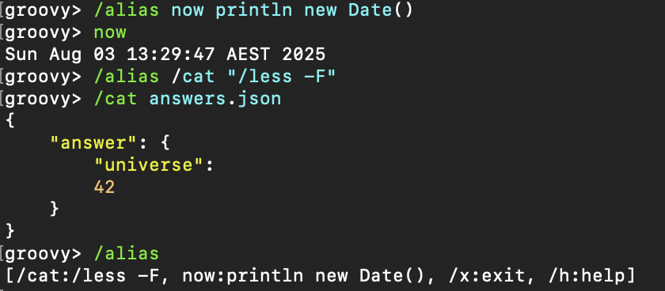

The fragment is expected to be at the start of a line but other text may follow:

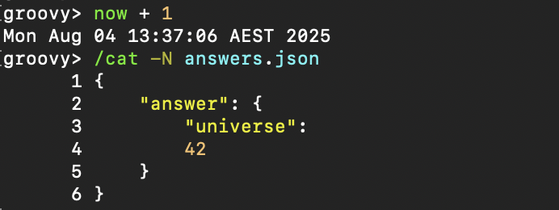

Aliases are persisted in a `.groovysh/aliases.json` file in the user home directory.

See also the `/unalias` command, which allows aliases to be removed.

[[GroovyShell-classloader]]
==== `/classloader`

Display and manage the Groovy classloader data.

Let's `/grab` a dependency, define a class using it, and then use the `/classloader` command to see the classloader data:

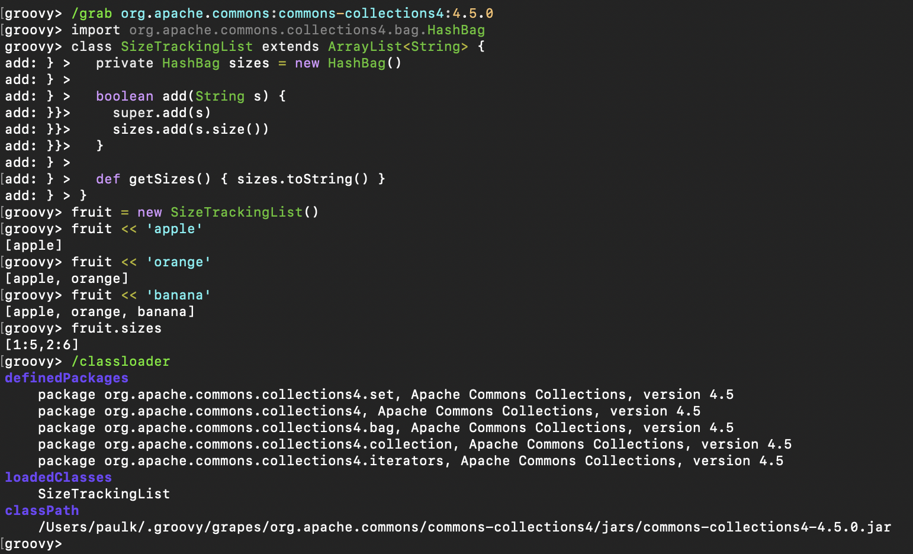

[[GroovyShell-clear]]
==== `/clear`

Clears the screen.

[[GroovyShell-colors]]
==== `/colors`

Displays the available colors.

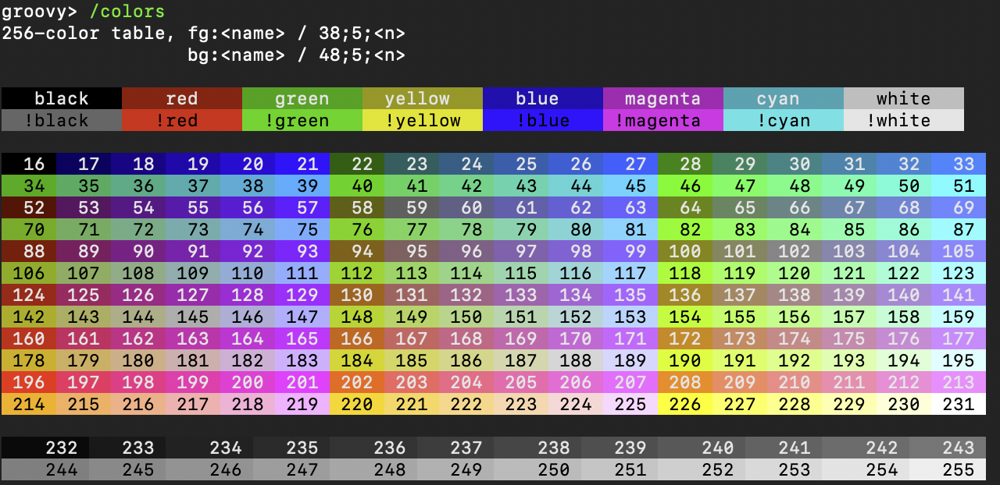

[[GroovyShell-del]]
==== `/del`

Deletes objects from the shell.

[[GroovyShell-echo]]
==== `/echo`

The `/echo` command outputs its arguments to the console. Arguments are output verbatim,
but variable expansion is also supported.

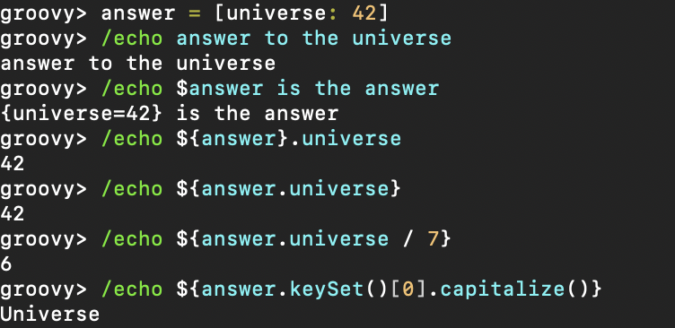

See also the `/prnt` command, which is similar but may perform additional formatting
on the output(s).

[[GroovyShell-exit]]
==== `/exit`

Exit the shell.

This is the *only* way to exit the shell. Well, you can still `CTRL-Z` on unix platforms,
but things like `CTRL_C` are trapped. (See JLine3 documentation for more details.)

[[GroovyShell-grab]]
==== `/grab`

Grab a dependency (Maven, Ivy, etc.) from Internet sources or cache,
and add it to the Groovy Shell environment.

[source,jshell]
----
groovy> /grab org.apache.commons:commons-collections4:4.5.0
groovy> import org.apache.commons.collections4.bidimap.TreeBidiMap
groovy> TreeBidiMap t = [apple: 'red']
{apple=red}
groovy> t.inverseBidiMap()
{red=apple}
----

Completion is available. Currently, completion options are populated
by known artifacts in the local Maven (~/.m2) and Grape (~/.groovy/grapes) repositories. In the future, completion from a remote repositories may be supported.

[source,jshell]
----
groovy> /grab org.apache.commons:commons-<TAB>
org.apache.commons:commons-collections4:     org.apache.commons:commons-exec:
org.apache.commons:commons-compress:         org.apache.commons:commons-imaging:
org.apache.commons:commons-configuration2:   org.apache.commons:commons-lang3:
org.apache.commons:commons-crypto:           org.apache.commons:commons-math3:
org.apache.commons:commons-csv:              org.apache.commons:commons-parent:
org.apache.commons:commons-dbcp2:            org.apache.commons:commons-pool2:
org.apache.commons:commons-digester3:        org.apache.commons:commons-text:
org.apache.commons:commons-email:
----

This command can be given at any time to add new dependencies.

[[GroovyShell-history]]
==== `/history`

Display, manage and recall edit-line history. The `/history` command has numerous options
which let you list (with various options), save, read, and clear the edit-line history.

----
groovy> /history -?
history -  list history of commands
Usage: history [-dnrfEie] [-m match] [first] [last]
       history -ARWI [filename]
       history -s [old=new] [command]
       history --clear
       history --save
  -? --help                      Displays command help
     --clear                     Clear history
     --save                      Save history
  -m match                       If option -m is present the first argument is taken as a pattern
                                 and only the history events matching the pattern will be shown
  -d                             Print timestamps for each event
  -f                             Print full time date stamps in the US format
  -E                             Print full time date stamps in the European format
  -i                             Print full time date stamps in ISO8601 format
  -n                             Suppresses command numbers
  -r                             Reverses the order of the commands
  -A                             Appends the history out to the given file
  -R                             Reads the history from the given file
  -W                             Writes the history out to the given file
  -I                             If added to -R, only the events that are not contained within the internal list are added
                                 If added to -W or -A, only the events that are new since the last incremental operation
                                 to the file are added
  [first] [last]                 These optional arguments may be specified as a number or as a string. A negative number
                                 is used as an offset to the current history event number. A string specifies the most
                                 recent event beginning with the given string.
  -e                             Uses the nano editor to edit the commands before executing
  -s                             Re-executes the command without invoking an editor
----

Here is an example of using the `/history` command:

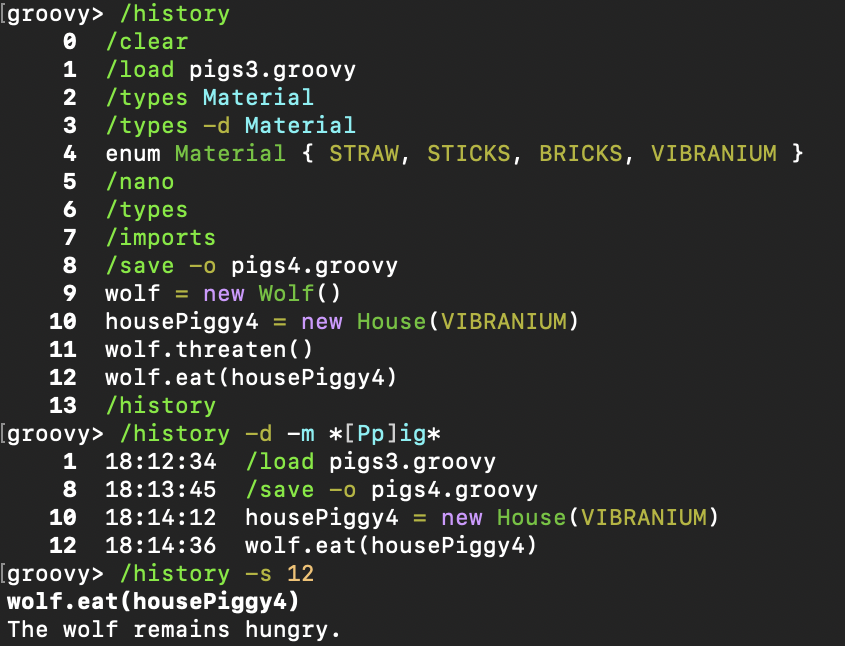

[[GroovyShell-import]]
==== `import`

Add a custom import which will be included for all shell evaluations.

[source,jshell]
--------------
groovy> import java.util.concurrent.BlockingDeque
--------------

This command can be given at any time to add new imports.

Completion is available and prompts a level at a time using the package structure of all known classes.

[source,jshell]
--------------
groovy> import java.util.concurrent.<TAB>
others
atomic                        locks
Classes
AbstractExecutorService       ConcurrentSkipListMap         ForkJoinPool
ArrayBlockingQueue            ConcurrentSkipListSet         ForkJoinTask
...
--------------

Once an import statement has been executed, relevant classes will become available for completion:

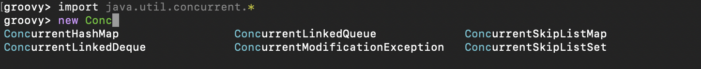

[[GroovyShell-imports]]
==== `/imports`

You can use this to list and delete existing imports.

[source,jshell]
--------------
groovy> /imports
import java.util.concurrent.BlockingQueue
--------------

[[GroovyShell-inspect]]
==== `/inspect`

Opens the GUI object browser to inspect a variable or the result of the
last evaluation.

[[GroovyShell-less]]
==== `/less`

Display the contents of a file (usually a page at a time).
Formatting of common file types is supported.

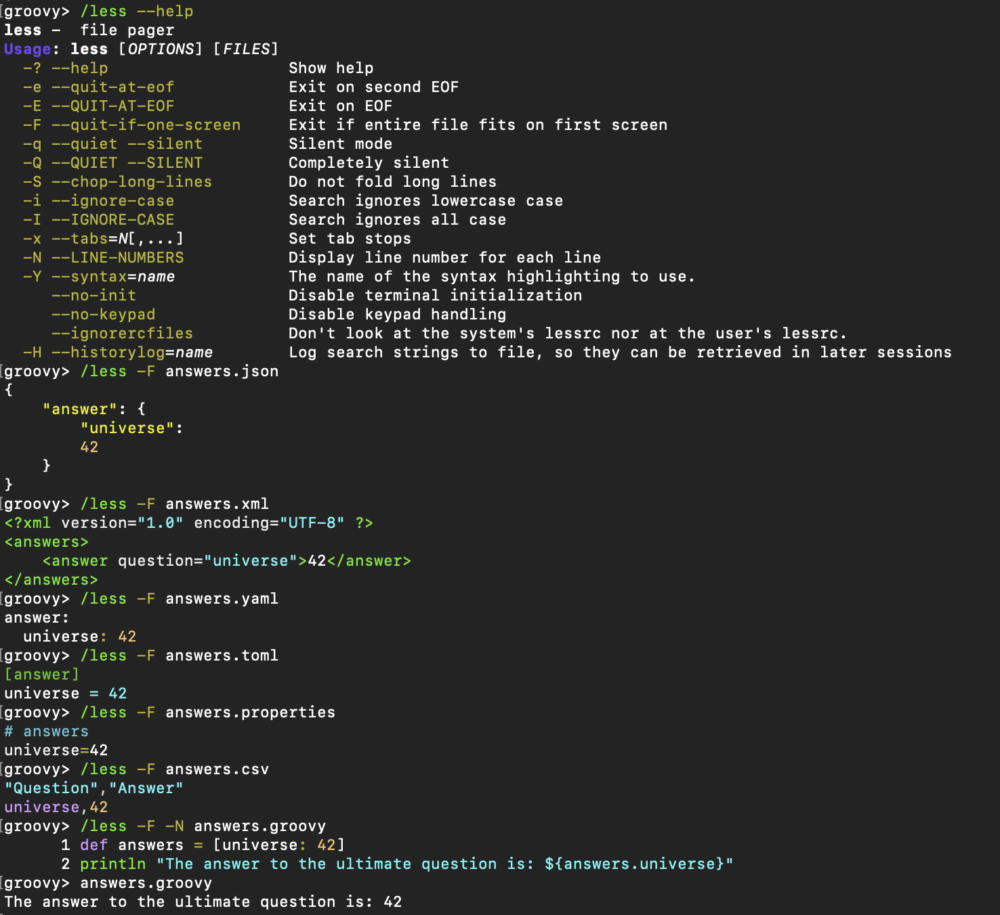

If no filename is given, the contents of the current buffer are displayed.

[[GroovyShell-load]]
==== `/load`

Load a file into the buffer.

If no filename is given as an argument, the current shared variables are
loaded from the `.groovy/groovysh.ser` file in the user home directory.

[[GroovyShell-nano]]
==== `/nano`

Edit files or the current buffer.

The `/nano` command has numerous options:

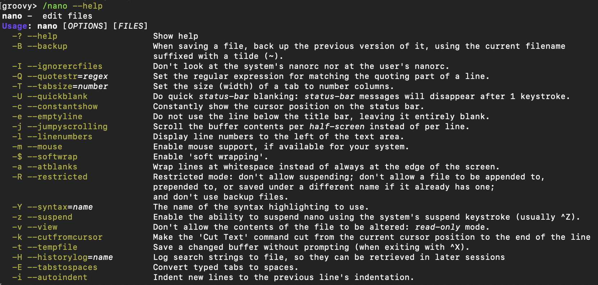

You can use the `/nano` command to edit files or the current buffer:

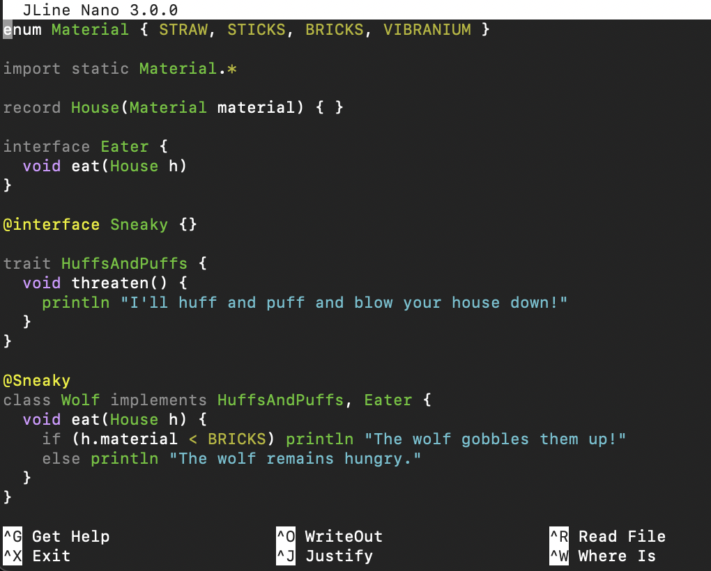

If editing the current buffer, when you exit and then save,
the buffer will be reloaded with the edited contents.

[[GroovyShell-prnt]]
==== `/prnt`

The `/prnt` command outputs its argument to the console. Both variable expansion
and formatting are supported.

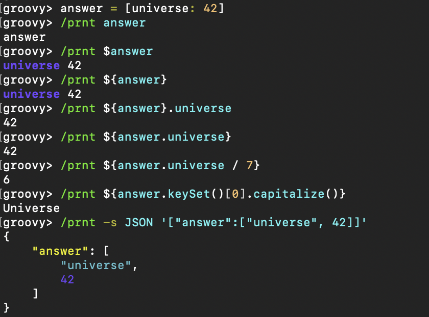

See also the `/echo` command, which is similar but takes multiple arguments.
It also supports variable expansion but doesn't support formatting.

[[GroovyShell-reset]]
==== `/reset`

Clears the current buffer and shared variables.

[[GroovyShell-save]]
==== `/save`

Saves the buffer’s contents to a file.

If no filename is given as an argument, the current shared variables are
saved into the `.groovy/groovysh.ser` file in the user home directory.

[[GroovyShell-show]]
==== `/show`

Show the shared variables (the binding).

[[GroovyShell-types]]
==== `/types`

Show the declared types (enums, interfaces, classes, traits, annotation definitions, and records).

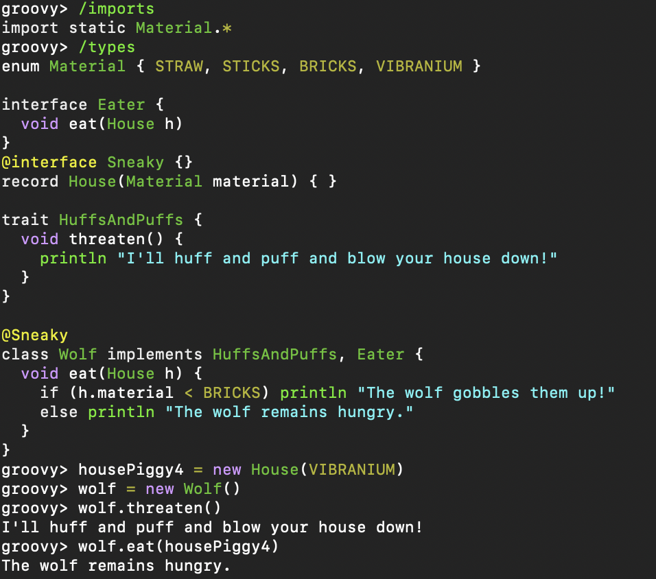

Types can be deleted using `/types -d` (completion is available) but see also the `/del` command:

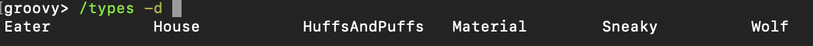

[[GroovyShell-doc]]
==== `/doc`

Opens a browser with documentation for the provided class.

For example, we can get both the Javadoc and GDK enhancements doc for `java.util.List` (shown running on JDK17):

[subs=attributes]
----
groovy:000> :doc java.util.List
https://docs.oracle.com/en/java/javase/17/docs/api/java.base/java/util/List.html
https://docs.groovy-lang.org/{groovy-full-version}/html/groovy-jdk/java/util/List.html
----

This will print the documentation URLs found and open two windows (or tabs, depending on your browser):

* one for the JDK documentation
* one for the GDK documentation

By default, for Java classes, the `java.base` module is assumed. You can specify an optional module
for other cases (shown running on JDK17):

----
groovy:000> :doc java.scripting javax.script.ScriptContext
https://docs.oracle.com/en/java/javase/17/docs/api/java.scripting/javax/script/ScriptContext.html
----

For backwards compatibility, if no module is specified when searching for Java classes, and no class is found in the `java.base` module, an additional attempt is made to find documentation for the class in the JDK8 (pre-module) Javadoc:

----
groovy:000> :doc javax.script.ScriptContext
https://docs.oracle.com/javase/8/docs/api/javax/script/ScriptContext.html
----

To get the Groovydoc for `groovy.ant.AntBuilder` and `groovy.xml.XmlSlurper`:

[subs=attributes]
----
groovy:000> :doc groovy.ant.AntBuilder
https://docs.groovy-lang.org/{groovy-full-version}/html/gapi/groovy/ant/AntBuilder.html
groovy:000> :doc groovy.xml.XmlSlurper
https://docs.groovy-lang.org/{groovy-full-version}/html/gapi/groovy/xml/XmlSlurper.html
----

To get both the Groovydoc and GDK enhancements doc for `groovy.lang.Closure` and `groovy.sql.GroovyResultSet`:

[subs=attributes]
----
groovy:000> :doc groovy.lang.Closure
https://docs.groovy-lang.org/{groovy-full-version}/html/gapi/groovy/lang/Closure.html
https://docs.groovy-lang.org/{groovy-full-version}/html/groovy-jdk/groovy/lang/Closure.html
groovy:000> :doc groovy.sql.GroovyResultSet
https://docs.groovy-lang.org/{groovy-full-version}/html/gapi/groovy/sql/GroovyResultSet.html
https://docs.groovy-lang.org/{groovy-full-version}/html/groovy-jdk/groovy/sql/GroovyResultSet.html
----

Documentation is also available for the GDK enhancements to primitive arrays and arrays of arrays:

[subs=attributes]
----
groovy:000> :doc int[]
https://docs.groovy-lang.org/{groovy-full-version}/html/groovy-jdk/primitives-and-primitive-arrays/int%5B%5D.html
groovy:000> :doc double[][]
https://docs.groovy-lang.org/{groovy-full-version}/html/groovy-jdk/primitives-and-primitive-arrays/double%5B%5D%5B%5D.html
----

NOTE: In contexts where opening a browser may not be desirable, e.g. on a CI server,
this command can be disabled by setting the `groovysh.disableDocCommand` system property to `true`.

[[GroovyShell-set]]
==== `set`

Set or list preferences.

[[GroovyShell-unalias]]
==== `/unalias`

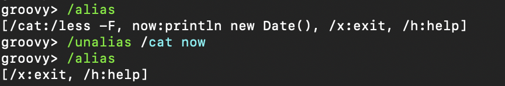

Allows aliases to be removed. They will be removed from persistent storage.

[[GroovyShell-Preferences]]
=== Preferences

Some aspects of `groovysh` behaviors can be customized by setting
preferences. Preferences are set using the `set` command or the `:=`
shortcut.

[[GroovyShell-RecognizedPreferences]]
==== Recognized Preferences

[[GroovyShell-InterpreterMode]]
===== `interpreterMode`

Allows the use of typed variables (i.e. `def` or other type information):

----
groovy:000> def x = 3
===> 3
groovy:000> x
===> 3
----

It's especially useful for copy&pasting code from tutorials etc. into the running session.

[[GroovyShell-verbosity]]
===== `verbosity`

Set the shell’s verbosity level. Expected to be one of:

* `DEBUG`
* `VERBOSE`
* `INFO`
* `QUIET`

Default is `INFO`.

If this preference is set to an invalid value, then the previous setting
will be used, or if there is none, then the preference is removed and
the default is used.

===== `colors`

Set the shell’s use of colors.

Default is `true`.

[[GroovyShell-show-last-result]]
===== `show-last-result`

Show the last result after an execution.

Default is `true`.

[[GroovyShell-sanitize-stack-trace]]
===== `sanitize-stack-trace`

Sanitize (trim-down/filter) stack traces.

Default is `true`.

[[GroovyShell-editor]]
===== `editor`

Configures the editor used by the `edit` command.

Default is the value of the system environment variable `EDITOR`.

To use TextEdit, the default text editor on macOS, configure:
set editor /Applications/TextEdit.app/Contents/MacOS/TextEdit

[[GroovyShell-SettingaPreference]]
==== Setting a Preference

-------------------
groovy:000> :set verbosity DEBUG
-------------------

[[GroovyShell-ListingPreferences]]
==== Listing Preferences

To list the current _set_ preferences (and their values):

----------------
groovy:000> :show preferences
----------------

Limitation: At the moment, there is no way to list all the
known/available preferences to be set.

[[GroovyShell-ClearingPreferencesieResettingtoDefaults]]
==== Clearing Preferences (i.e. Resetting to Defaults)

-----------------
groovy:000> :purge preferences
-----------------

[[GroovyShell-UserProfileScriptsandState]]
=== User Profile Scripts and State

[[GroovyShell-ProfileScripts]]
==== Profile Scripts

[[GroovyShell-HOMEgroovygroovyshprofile]]
===== `$HOME/.groovy/groovysh.profile`

This script, if it exists, is loaded when the shell starts up.

[[GroovyShell-HOMEgroovygroovyshrc]]
===== `$HOME/.groovy/groovysh.rc`

This script, if it exists, is loaded when the shell enters interactive
mode.

[[GroovyShell-State]]
==== State

[[GroovyShell-HOMEgroovygroovyshhistory]]
===== `$HOME/.groovy/groovysh.history`

Edit-line history is stored in this file.

[[GroovyShell-widgets]]
=== Widgets

JLine provides a https://jline.org/docs/advanced/widgets/[powerful widget system]
that lets you extend the functionality of its line reader.
A number of builtin widgets are available including `end-of-line`, `beginning-of-line`, `forward-word`, `backward-word`, `kill-word`, `backward-kill-word`, `capitalize-word`, `transpose-words`, and `yank-pop`, just to name a few. You can use the `/keymap` command to see the key bindings for these widgets.

Groovy also includes JLine's _tailtip_ and _autosuggest_ widget functionality.
You can see the related widgets by using the `/widget -l` command, which lists custom widgets.

[source,shell]
----
groovy> /widget -l
_autosuggest-end-of-line (_autosuggest-end-of-line)
_autosuggest-forward-char (_autosuggest-forward-char)
_autosuggest-forward-word (_autosuggest-forward-word)
_tailtip-accept-line (_tailtip-accept-line)
_tailtip-backward-delete-char (_tailtip-backward-delete-char)
_tailtip-delete-char (_tailtip-delete-char)
_tailtip-expand-or-complete (_tailtip-expand-or-complete)
_tailtip-kill-line (_tailtip-kill-line)
_tailtip-kill-whole-line (_tailtip-kill-whole-line)
_tailtip-redisplay (_tailtip-redisplay)
_tailtip-self-insert (_tailtip-self-insert)
autosuggest-toggle (autosuggest-toggle)
tailtip-toggle (tailtip-toggle)
tailtip-window (tailtip-window)
----

These are available but not enabled by default.
You can enable them using the related _toggle_ widgets. You can see what
https://jline.org/docs/advanced/key-bindings[key bindings]
are associated with these widgets by using the `/keymap` command.

[source,shell]
----
groovy> /keymap
...
"^[s" tailtip-toggle
"^[v" autosuggest-toggle
...
----

Normally, completions are shown when you hit the 'TAB' key, but with the tailtip widget enabled,
you can see completions as you type., as well as additional usage information given in the
tailtip window as seen here for a command:

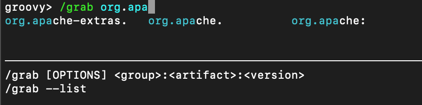

And here for some code:

image:assets/img/widget3.png[Tailtip, width=60%]

With the autosuggest widget enabled, you can see suggestions for what to type next
as you type, based on your history, as seen here:

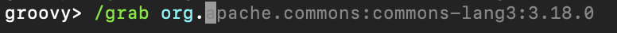

You can accept the entire suggestion or a word at a time. Both widgets can be enabled.

[[GroovyShell-register]]
=== Custom commands

The `register` command allows you to register custom commands in the shell. For example, writing the following
will register the `Stats` command:

----
groovy:000> :register Stats
----

where the `Stats` class is a class extending the `org.apache.groovy.groovysh.CommandSupport` class. For example:

[source,groovy]
----

class Stats extends CommandSupport {
    protected Stats(final Groovysh shell) {
        super(shell, 'stats', 'T')
    }

    public Object execute(List args) {
        println "Free memory: ${Runtime.runtime.freeMemory()}"
    }

}
----

Then the command can be called using:

----
groovy:000> :stats
stats
Free memory: 139474880
groovy:000>
----

Note that the command class must be found on classpath: you cannot define a new command from within the shell.

[[GroovyShell-PlatformProblems]]
==== Platform Problems

[[GroovyShell-ProblemsloadingtheJLineDLL]]
===== Problems loading the JLine DLL

On Windows, https://github.com/jline/jline2[JLine2] (which is used for the fancy
shell input/history/completion fluff), uses a *tiny* DLL file to trick
the *evil* Windows faux-shell (`CMD.EXE` or `COMMAND.COM`) into
providing Java with unbuffered input. In some rare cases, this might
fail to load or initialize.

One solution is to disable the frills and use the unsupported terminal
instance. You can do that on the command-line using the `--terminal`
flag and set it to one of:

* `none`
* `false`
* `off`
* `jline.UnsupportedTerminal`

------------------------
groovysh --terminal=none
------------------------

[[GroovyShell-ProblemswithCygwinonWindows]]
===== Problems with Cygwin on Windows

Some people have issues when running groovysh with cygwin. If you have
troubles, the following may help:

------------------------
stty -icanon min 1 -echo
groovysh --terminal=unix
stty icanon echo
------------------------

[[GroovyShell-GMavenPlus]]
== GMavenPlus Maven Plugin
https://github.com/groovy/GMavenPlus[GMavenPlus] is a Maven plugin with goals
that support launching a Groovy Shell or Groovy Console bound to a Maven
project.

[[GroovyShell-GradleGroovyshPlugin]]
== Gradle Groovysh Plugin
https://github.com/tkruse/gradle-groovysh-plugin[Gradle Groovysh Plugin] is a Gradle plugin that provides gradle tasks to start a Groovy Shell bound to a Gradle project.
